# Game Chat Room Service — Project Architecture Handbook

> **Repository:** `BECHATROOM` (artifact: `game-chat` v1.0.0-SNAPSHOT, V8 baseline)  
> **Generated for:** interview preparation and deep architectural understanding  
> **Last analyzed:** August 24, 2026

---

# Table of Contents

1. [Executive Summary](#1-executive-summary)
2. [Repository Overview](#2-repository-overview)
3. [Technology Stack Deep Dive](#3-technology-stack-deep-dive)
4. [System Architecture](#4-system-architecture)
5. [Complete Request Lifecycle](#5-complete-request-lifecycle)
6. [Every Service Explained](#6-every-service-explained)
7. [Every API Explained](#7-every-api-explained)
8. [Authentication Deep Dive](#8-authentication-deep-dive)
9. [Database Deep Dive](#9-database-deep-dive)
10. [Redis Deep Dive](#10-redis-deep-dive)
11. [Message Queue Deep Dive (Kafka)](#11-message-queue-deep-dive-kafka)
12. [Docker Deep Dive](#12-docker-deep-dive)
13. [Nginx Deep Dive](#13-nginx-deep-dive)
14. [Configuration Files](#14-configuration-files)
15. [Codebase Design Patterns](#15-codebase-design-patterns)
16. [SOLID Principles](#16-solid-principles)
17. [Folder-by-Folder Deep Dive](#17-folder-by-folder-deep-dive)
18. [Important Classes Explained](#18-important-classes-explained)
19. [Important Functions Explained](#19-important-functions-explained)
20. [Middleware Flow](#20-middleware-flow)
21. [Error Handling](#21-error-handling)
22. [Logging System](#22-logging-system)
23. [Security Review](#23-security-review)
24. [Performance Analysis](#24-performance-analysis)
25. [Scalability Analysis](#25-scalability-analysis)
26. [CI/CD Pipeline](#26-cicd-pipeline)
27. [Testing Strategy](#27-testing-strategy)
28. [Complete Feature Walkthroughs](#28-complete-feature-walkthroughs)
29. [Sequence Diagrams](#29-sequence-diagrams)
30. [Interview Preparation](#30-interview-preparation)
31. [Explain Like I'm in an Interview](#31-explain-like-im-in-an-interview)
32. [Hidden Gems](#32-hidden-gems)
33. [Improvement Roadmap](#33-improvement-roadmap)
34. [Complete Dependency Graph](#34-complete-dependency-graph)
35. [Startup and Shutdown Lifecycle](#35-startup-and-shutdown-lifecycle)
36. [End-to-End Data Flow](#36-end-to-end-data-flow)

---

# 1. Executive Summary

## What This Project Does

**Game Chat Room Service** is a production-oriented, real-time multiplayer game chat platform. It provides typed chat rooms (global lobby, game rooms, teams, parties, private DMs), WebSocket-based live messaging, presence indicators, moderation tooling, file attachments, full-text search, and observability—all runnable entirely in Docker.

## Business Problem It Solves

Multiplayer games need low-latency, reliable in-game communication with room isolation, moderation, and audit trails. This system demonstrates how to build that at scale: **PostgreSQL as source of truth**, **Redis for cross-node live fan-out**, **Kafka for post-commit event logging**, and **horizontally scaled Spring Boot nodes** behind an HTTPS nginx gateway.

## Target Users

| User | Usage |
|------|-------|
| **Players** | Register, join rooms, chat in real time, react, attach files, set presence |
| **Moderators / Owners** | Kick, mute, ban, promote, resolve reports |
| **Operators / SRE** | Prometheus metrics, Grafana dashboards, Loki logs, k6 load tests |
| **Developers / Interviewees** | Reference architecture for distributed real-time chat |

## Core Features

- JWT access tokens (15 min) + rotating HttpOnly refresh cookies (7 days)
- Custom JSON WebSocket protocol at `/ws/chat` (not STOMP)
- Two chat nodes (`chat-a`, `chat-b`) with Redis pub/sub fan-out
- Room types: `GLOBAL`, `GAME_ROOM`, `TEAM`, `PARTY`, `PRIVATE`
- Monotonic per-room message sequences, idempotent sends via `requestId`
- Presence: `ONLINE`, `AWAY`, `IN_GAME`, `OFFLINE` with Redis + sweeper
- Moderation: kick, mute, ban, promote/demote, reports inbox
- Attachments via MinIO (S3-compatible) with JWT-gated download
- Postgres FTS search on message content
- Kafka audit pipeline + dedicated `audit-consumer` profile
- React SPA with traffic inspector for debugging

## Why This Architecture Was Chosen

| Decision | Rationale |
|----------|-----------|
| **PostgreSQL** | ACID, relational room membership, FTS, Flyway migrations |
| **Redis pub/sub** | Sub-millisecond cross-node broadcast; not durable (by design for live events) |
| **Kafka (optional log)** | Durable post-commit audit/analytics without blocking chat path |
| **Two Spring Boot nodes** | Proves stateless REST + sticky-free WS fan-out via Redis |
| **nginx gateway** | TLS termination, `least_conn` load balancing, long WS timeouts |
| **Short-lived JWT + refresh rotation** | Limits stolen-token blast radius; family revocation on reuse |
| **Post-connect WS AUTH** | Avoids JWT in query strings (logs, referrer leakage) |

## Technology Stack Overview

| Layer | Technology | Version |
|-------|------------|---------|
| Backend | Spring Boot / Java | 3.4.5 / 21 |
| Frontend | React + Vite | 18.3 / 6.0 |
| Database | PostgreSQL + Flyway | 16 |
| Cache / Bus | Redis | 7 |
| Event Log | Apache Kafka (KRaft) | 3.9.0 |
| Object Store | MinIO (S3 API) | 2025-04-22 |
| Gateway | nginx | alpine |
| Metrics | Prometheus + Micrometer | v3.2.1 |
| Dashboards | Grafana | 11.5.2 |
| Logs | Loki + Promtail | 3.4.2 |
| Load Test | k6 | 0.57.0 |
| Auth | JWT (jjwt) + BCrypt | 0.12.6 |

## Elevator Pitch (Interview-Ready)

> "I built a horizontally scalable game chat service where PostgreSQL owns all durable state, Redis pub/sub delivers live messages across two Spring Boot nodes in under a millisecond, and Kafka captures post-commit audit events without touching the hot path. Clients use short-lived JWTs with rotating refresh cookies, authenticate WebSockets via a post-connect AUTH frame, and receive monotonic per-room message sequences with idempotent retries. The whole stack—React UI, TLS nginx gateway, Postgres, Redis, Kafka, MinIO, and Grafana observability—runs with a single `docker compose up`."

---

# 2. Repository Overview

## Complete Folder Tree

```
BECHATROOM/
├── .env.example                    # Host environment template
├── .gitignore
├── API.md                          # REST + WebSocket API reference
├── README.md                       # Quick start, V6–V8 feature checklist
├── docker-compose.yml              # Full stack orchestration
├── Game_Chat_Room_Service_Project_Specification(1).pdf
│
├── backend/                        # Spring Boot application (single JAR, multiple roles)
│   ├── Dockerfile
│   ├── pom.xml
│   └── src/
│       ├── main/
│       │   ├── java/com/example/gamechat/
│       │   │   ├── GameChatApplication.java
│       │   │   ├── auth/           # Registration, login, JWT, refresh tokens
│       │   │   ├── room/           # Rooms, membership, moderation
│       │   │   ├── chat/           # Messages, WS, presence, Redis bus
│       │   │   ├── kafka/          # Optional event log producers
│       │   │   ├── audit/          # Kafka → DB audit consumer (profile: audit)
│       │   │   ├── storage/        # Local / S3 object store abstraction
│       │   │   └── common/         # Pagination, global exception handling
│       │   └── resources/
│       │       ├── application.yml
│       │       ├── application-audit.yml
│       │       └── db/migration/   # Flyway V1–V7
│       └── test/                   # Unit + integration tests (Testcontainers)
│
├── frontend/                       # React SPA
│   ├── Dockerfile                  # Multi-stage: Node build → nginx serve
│   ├── nginx.conf                  # SPA + reverse proxy to gateway
│   ├── package.json
│   ├── vite.config.js
│   └── src/
│       ├── api/                    # REST client modules
│       ├── auth/                   # AuthContext
│       ├── chat/                   # ChatContext (WS + state)
│       ├── components/             # UI components
│       ├── pages/                  # Login, Register, Chat
│       ├── styles/
│       └── ws/                     # WebSocket client
│
├── gateway/                        # TLS terminator + LB for chat nodes
│   ├── Dockerfile
│   └── nginx.conf
│
├── certs/                          # Local CA + server certs (generated at compose start)
│   ├── generate.sh
│   └── .gitignore
│
└── observability/
    ├── prometheus.yml
    ├── loki/loki.yml
    ├── promtail/promtail.yml
    ├── grafana/
    │   ├── dashboards/gamechat.json
    │   └── provisioning/
    └── k6/chat.js                  # Load test script (profile: loadtest)
```

## Folder Responsibilities

### `backend/`

| Aspect | Detail |
|--------|--------|
| **Purpose** | All business logic, persistence, WebSocket handling, Redis/Kafka integration |
| **Entry point** | `GameChatApplication.java` |
| **Key deps** | Spring Web, Security, JPA, WebSocket, Redis, Kafka, Flyway, jjwt, AWS S3 SDK |
| **Deploy roles** | Same JAR runs as `chat-a`, `chat-b`, or `audit-consumer` (profile-driven) |

### `frontend/`

| Aspect | Detail |
|--------|--------|
| **Purpose** | Browser UI for auth, room management, live chat |
| **Build** | Vite → static `dist/` served by nginx |
| **Key deps** | React 18, React Router 6 |
| **Proxy pattern** | `/api/*` and `/ws/*` proxied to `gateway` container |

### `gateway/`

| Aspect | Detail |
|--------|--------|
| **Purpose** | External TLS API/WS entry on host `:8080` |
| **LB strategy** | nginx `least_conn` across `chat-a:8080` and `chat-b:8080` |
| **Security** | Blocks public `/actuator/prometheus` (404) |

### `certs/`

| Aspect | Detail |
|--------|--------|
| **Purpose** | Self-signed CA + server cert for local HTTPS |
| **Trigger** | `certs-init` service runs `generate.sh` before gateway/frontend start |

### `observability/`

| Aspect | Detail |
|--------|--------|
| **Purpose** | Metrics, logs, dashboards, load testing |
| **Components** | Prometheus, Grafana, Loki, Promtail, k6 |

### Components That Do **NOT** Exist

- Kubernetes manifests
- Terraform / IaC
- GitHub Actions / CI workflows (`.github/` absent)
- RabbitMQ (uses Redis pub/sub + Kafka instead)
- gRPC
- Prisma / MongoDB / MySQL
- OpenAPI/Swagger spec files (API documented in `API.md`)

---

# 3. Technology Stack Deep Dive

## Spring Boot 3.4.5 (Java 21)

| | |
|---|---|
| **Why** | Mature ecosystem for REST, JPA, Security, WebSocket, Actuator, Kafka |
| **Role** | Monolithic service packaged as one JAR; horizontal scale via multiple containers |
| **Alternatives** | Quarkus (faster startup), Node/NestJS (single language with React), Go (lower memory) |
| **Interview line** | "We chose Spring Boot for transactional JPA, built-in observability, and WebSocket support; Java 21 gives us virtual-thread readiness if we need it later." |

## PostgreSQL 16

| | |
|---|---|
| **Why** | ACID transactions for message ordering, FK integrity, FTS (`tsvector`), JSONB audit |
| **Role** | Source of truth: users, rooms, messages, tokens, bans, read cursors |
| **Alternatives** | CockroachDB (geo), MongoDB (flexible schema—but weaker FK/FTS for this model) |
| **Interview line** | "Postgres gives us pessimistic locking for sequence allocation and GIN-indexed full-text search without a separate search engine." |

## Flyway

| | |
|---|---|
| **Why** | Versioned SQL migrations checked into repo |
| **Role** | V1–V7 migrations; Hibernate `ddl-auto: validate` only |
| **Alternatives** | Liquibase, manual SQL |

## Redis 7

| | |
|---|---|
| **Why** | In-memory speed for pub/sub, rate limits, presence, token denylist |
| **Role** | **Not** primary cache for messages; live coordination layer |
| **Alternatives** | NATS (pub/sub), Hazelcast (embedded cluster state) |

## Apache Kafka 3.9.0 (KRaft)

| | |
|---|---|
| **Why** | Durable append-only log for audit/analytics decoupled from chat latency |
| **Role** | Post-commit events only; `KAFKA_ENABLED=false` by default in local `application.yml`, `true` in Docker |
| **Alternatives** | RabbitMQ (task queues), Pulsar, direct DB audit writes |
| **Interview line** | "Kafka is intentionally off the hot path—we publish after DB commit for observability, not for delivering chat messages." |

## MinIO (S3-compatible)

| | |
|---|---|
| **Why** | S3 API without AWS; same code path as production S3 |
| **Role** | Attachment blob storage; metadata in Postgres |
| **Alternatives** | Local filesystem (`LocalObjectStore` when `S3_ENABLED=false`) |

## nginx (Gateway + Frontend)

| | |
|---|---|
| **Why** | Battle-tested TLS termination, WS proxying, load balancing |
| **Role** | Gateway LB; frontend static hosting + API proxy |
| **Alternatives** | Traefik, Envoy, HAProxy |

## React 18 + Vite 6

| | |
|---|---|
| **Why** | Component model fits chat UI; Vite for fast builds in Docker |
| **Role** | SPA with Context-based state (no Redux) |
| **Alternatives** | Vue, Svelte, Next.js (SSR not needed here) |

## JWT (jjwt 0.12.6)

| | |
|---|---|
| **Why** | Stateless access tokens for REST + WS AUTH frame |
| **Role** | HS256 signed; 15-minute TTL; `jti` for denylist on logout |
| **Alternatives** | OAuth2/OIDC (overkill for demo), opaque session tokens (requires server session store) |

## Micrometer + Prometheus

| | |
|---|---|
| **Why** | Standard Spring Boot metrics export |
| **Role** | `chat.messages.sent`, `chat.ws.connections`, JVM, HTTP, Redis, Kafka metrics |
| **Scrape** | Basic auth; gateway blocks external `/actuator/prometheus` |

## Loki + Promtail

| | |
|---|---|
| **Why** | Log aggregation correlated with metrics in Grafana |
| **Role** | Docker container logs from chat, gateway, frontend, audit-consumer |

## k6

| | |
|---|---|
| **Why** | Scriptable load tests in CI-like Docker profile |
| **Role** | Two-user register → room → WS chat scenario |

## Docker Compose

| | |
|---|---|
| **Why** | Single-command full stack for demos and integration tests |
| **Role** | 15+ services with health checks and dependency ordering |

---

# 4. System Architecture

## High-Level Architecture

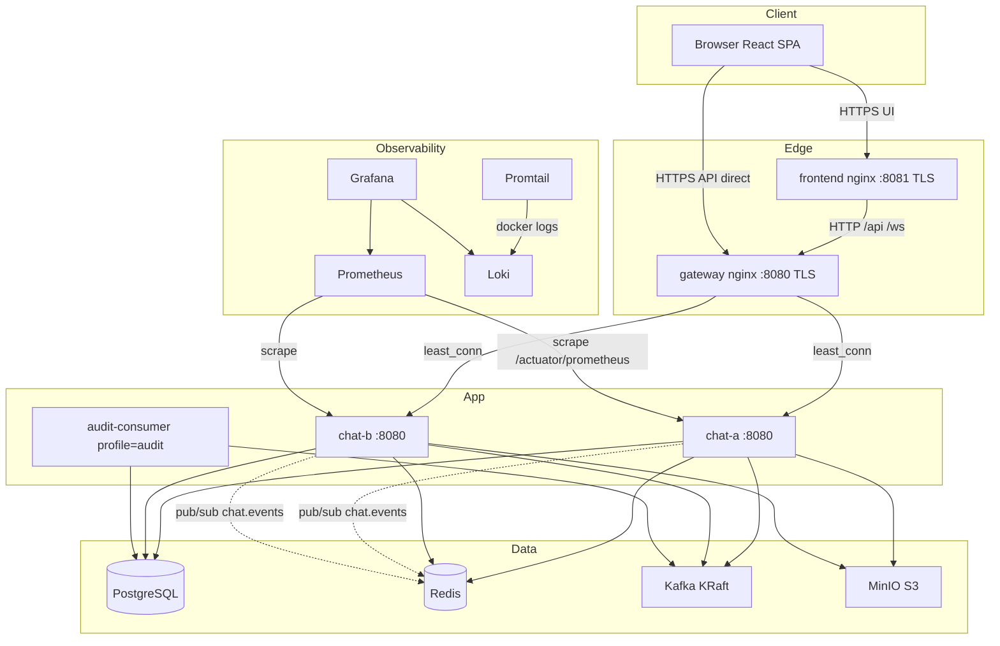

## Arrow Explanations

| Arrow | Meaning |
|-------|---------|
| Browser → frontend | User loads SPA over TLS; same-origin `/api` and `/ws` proxied internally |
| frontend → gateway | Plain HTTP inside Docker network; TLS terminated at frontend edge |
| gateway → chat-a/b | Load-balanced REST and WebSocket; sticky sessions **not** required |
| chat → Postgres | All durable writes (messages, users, tokens) |
| chat → Redis | Pub/sub fan-out, presence, rate limits, JWT denylist |
| chat → Kafka | Fire-and-forget post-commit audit events |
| audit-consumer → Kafka | Reads topics, persists to `audit_events` table |
| chat → MinIO | Upload/download attachment blobs |
| Redis pub/sub | When chat-a publishes `MESSAGE`, chat-b's listener pushes to its local WS sessions |
| Promtail → Loki | Ships container stdout/stderr |

## Service Communication Matrix

| From | To | Protocol | Purpose |
|------|-----|----------|---------|
| Frontend | Gateway | HTTP/WS | API + real-time |
| Chat node | Postgres | JDBC | CRUD |
| Chat node | Redis | RESP | Pub/sub, keys, Lua |
| Chat node | Kafka | Kafka protocol | Event log |
| Chat node | MinIO | S3 HTTP | Object storage |
| Prometheus | Chat node | HTTP | Metrics scrape |
| Promtail | Docker socket | — | Log discovery |

## Client-Server Flow (Typical Chat Message)

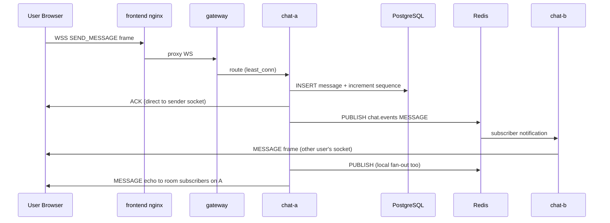

---

# 5. Complete Request Lifecycle

## 5.1 Login Request (REST)

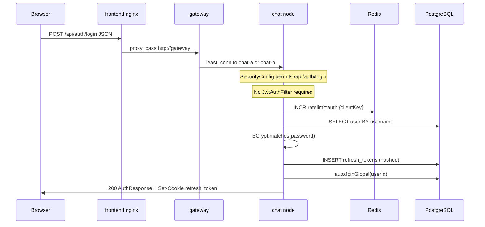

**Step-by-step:**

1. **Browser** — `LoginPage.jsx` calls `auth.js` → `client.js` `fetch` with `credentials: "include"`.
2. **frontend nginx** — `location /api/` proxies to `http://gateway` with forwarded cookies/headers.
3. **gateway nginx** — `proxy_pass http://chat` upstream; picks node via `least_conn`.
4. **Spring DispatcherServlet** — routes to `AuthController.login`.
5. **Security** — `SecurityConfig` `@Order(2)` permits POST `/api/auth/login` without authentication.
6. **Rate limit** — `RateLimitService.checkAuth(clientKey)` using Redis; clientKey from `X-Forwarded-For` or remote IP.
7. **AuthService.login** — loads user, verifies BCrypt hash, checks `ACTIVE` status.
8. **RoomService.autoJoinGlobal** — ensures membership in seeded Global Lobby room.
9. **Token issuance** — `JwtService.createToken` (access) + new refresh token row (SHA-256 hash stored).
10. **Response** — JSON `{ accessToken, expiresIn, userId, username }` + `RefreshCookieService` sets HttpOnly cookie.
11. **Frontend** — `AuthContext` stores session in `sessionStorage`, schedules refresh timer.

## 5.2 Register Request

Same pipeline as login, plus uniqueness checks on username/email, user INSERT, then global lobby auto-join. Returns `201 Created`.

## 5.3 Token Refresh

1. Timer or 401 retry triggers `POST /api/auth/refresh` with cookie only.
2. `AuthService.refresh` hashes cookie value, loads `RefreshToken` row.
3. If revoked/expired → **revoke entire family** (reuse detection).
4. Otherwise revoke current row, issue new access + refresh in same `family_id`.
5. Frontend updates `sessionStorage` with new access token.

## 5.4 Send Message (WebSocket — Primary Write Path)

1. User types in `Composer.jsx` → `ChatContext.sendMessage` → `chatSocket.sendMessage`.
2. WS frame: `{ type: "SEND_MESSAGE", roomId, content, requestId }`.
3. **chat node** `ChatWebSocketHandler.handleSend`:
   - Validates authenticated session.
   - `RateLimitService.checkSend(userId)` via Redis.
   - `ChatService.sendMessage` → `MessageService.persist`:
     - `RoomRepository.findByIdForUpdate` (pessimistic lock).
     - Increment `rooms.last_sequence`, assign to message.
     - Idempotent: unique `(room_id, sender_id, request_id)` if requestId present.
   - Responds `ACK` to sender on same node.
   - `ChatEventPublisher.publishAfterCommit` → Redis channel `chat.events`.
4. **All nodes** `ChatEventListener` deserializes event → `LocalFrameSender.sendToRoom` → WS `MESSAGE` frame.
5. **Kafka** (if enabled): `KafkaChatEventLog.messagePersisted` after commit.

## 5.5 Join Room (REST + WS)

**REST:** `POST /api/rooms/{id}/join` adds `room_members` row (checks capacity, bans, invite rules).

**WS:** Client sends `JOIN_ROOM` → server validates membership → `HISTORY_SYNC` (missed messages) → `JOINED` → `PRESENCE_SNAPSHOT` → publishes `PRESENCE ONLINE` if first connection in room.

## 5.6 Attachment Upload

1. `POST /api/rooms/{roomId}/attachments` multipart.
2. `JwtAuthFilter` authenticates.
3. `AttachmentService` validates membership, not muted, file type/size.
4. `ObjectStore.put` → MinIO or local disk.
5. Creates message row + `message_attachments` metadata.
6. Returns `MessageResponse` with attachment metadata.
7. Download via `GET /api/attachments/{id}` streams bytes after JWT + membership check.

## 5.7 Search Messages

1. `GET /api/rooms/{roomId}/messages/search?q=...`
2. `MessageRepository` queries `content_tsv @@ plainto_tsquery('simple', q)`.
3. Returns paginated `PageResponse<MessageResponse>`.

---

# 6. Every Service Explained

## 6.1 Spring Boot Application (`GameChatApplication`)

**File:** `backend/src/main/java/com/example/gamechat/GameChatApplication.java`

| Aspect | Detail |
|--------|--------|
| **Purpose** | Bootstrap Spring context; enable scheduling for sweepers |
| **Startup** | JVM loads JAR → Spring auto-config → Flyway migrations → Redis/Kafka listeners → WS endpoint registered |
| **Profiles** | Default: chat node; `audit`: enables `AuditEventListener` only |
| **Shutdown** | Spring graceful stop; WS sessions closed; Redis listener unsubscribes |

## 6.2 AuthService

**File:** `backend/src/main/java/com/example/gamechat/auth/service/AuthService.java`

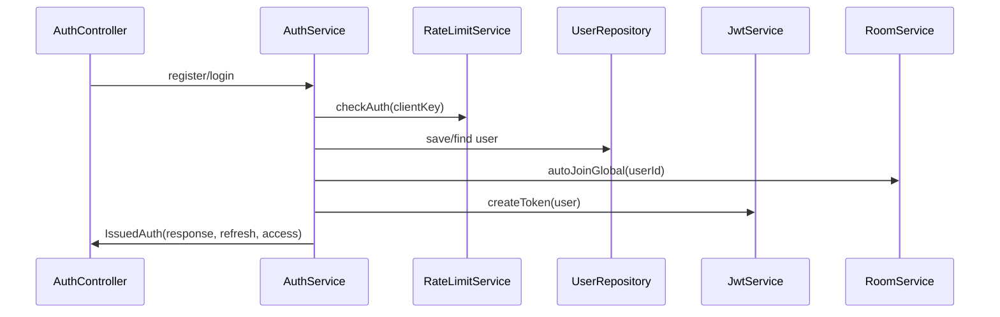

- **Dependencies:** UserRepository, RefreshTokenRepository, PasswordEncoder, JwtService, TokenDenylist, RoomService, RateLimitService
- **Refresh rotation:** Old token revoked; new token same `family_id`; reuse of revoked token revokes family
- **Logout:** Denylists access `jti` in Redis; revokes refresh family

## 6.3 RoomService

**File:** `backend/src/main/java/com/example/gamechat/room/service/RoomService.java`

| Responsibility | Detail |
|----------------|--------|
| Room CRUD | Create typed rooms, private DMs via `direct_key` |
| Membership | Join/leave with capacity, ban, invite-code rules |
| Moderation | Kick, mute, ban, promote/demote, reports |
| Read cursors | `unreadCount` = `last_sequence - last_read_sequence` |
| Events | Publishes Redis events for kicks; Kafka moderation log |

**Room type rules:**

| Type | Join mechanism |
|------|----------------|
| `GLOBAL` | Auto-joined on register/login; cannot leave |
| `GAME_ROOM` | Open join by room ID until full |
| `TEAM` / `PARTY` | Requires invite code |
| `PRIVATE` | `POST /api/rooms/private`; strangers blocked |

## 6.4 ChatService

**File:** `backend/src/main/java/com/example/gamechat/chat/service/ChatService.java`

Orchestrates message send/delete/edit, delegates persistence to `MessageService`, enforces rate limits, records metrics, triggers Kafka log.

## 6.5 MessageService

**File:** `backend/src/main/java/com/example/gamechat/chat/service/MessageService.java`

- Pessimistic lock on room for sequence allocation
- History pagination (newest-first vs sync oldest-first)
- Reactions, soft delete, 5-minute edit window
- FTS search via `MessageRepository`

## 6.6 PresenceService

**File:** `backend/src/main/java/com/example/gamechat/chat/service/PresenceService.java`

- Redis hashes: `presence:room:{roomId}`, sets: `presence:rooms:{userId}`
- Lua scripts for atomic join/leave with connection counting
- TTL keys: `presence:hb:{roomId}:{userId}`
- Global status: `presence:user:{userId}`

## 6.7 ChatWebSocketHandler

**File:** `backend/src/main/java/com/example/gamechat/chat/websocket/ChatWebSocketHandler.java`

Central WS dispatcher. Parses JSON frames by `type` field. Maintains auth state per session via `SessionRegistry`.

**Supporting components:**

| Class | Role |
|-------|------|
| `SessionRegistry` | Maps sessionId ↔ userId ↔ subscribed rooms |
| `LocalFrameSender` | Writes JSON to all sessions in a room |
| `WebSocketHeartbeatSweeper` | Closes idle (60s) and unauth (3s) sessions |
| `JwtHandshakeInterceptor` | Allows all handshakes (auth deferred to AUTH frame) |

## 6.8 ChatEventPublisher / ChatEventListener (Redis Bus)

**Files:** `backend/src/main/java/com/example/gamechat/chat/bus/`

```25:36:backend/src/main/java/com/example/gamechat/chat/bus/ChatEventPublisher.java
    public void publishAfterCommit(ChatEvent event) {
        if (TransactionSynchronizationManager.isSynchronizationActive()) {
            TransactionSynchronizationManager.registerSynchronization(new TransactionSynchronization() {
                @Override
                public void afterCommit() {
                    publish(event);
                }
            });
            return;
        }
        publish(event);
    }
```

- **Channel:** `chat.events` (`RedisConfig.CHANNEL`)
- **Listener:** Deserializes `ChatEvent`, routes to `LocalFrameSender` or handles `DROP_USER`

## 6.9 KafkaChatEventLog / AuditEventListener

| Component | When active | Purpose |
|-----------|-------------|---------|
| `KafkaChatEventLog` | `app.kafka.enabled=true` | Produces to 4 topics after DB commit |
| `NoOpChatEventLog` | Kafka disabled | No-op stub |
| `ChatEventLogListener` | Kafka + `log-listener=true` | Logs to stdout (dev) |
| `AuditEventListener` | Profile `audit` | Persists JSON payload to `audit_events` |

**Topics:**

| Topic | Key | Payload fields |
|-------|-----|----------------|
| `chat.message.persisted` | roomId | messageId, senderId, sequenceNumber, timestamp |
| `chat.user.joined` | roomId | roomId, userId |
| `chat.user.left` | roomId | roomId, userId |
| `chat.moderation` | roomId | action, actorId, optional messageId |

## 6.10 ObjectStore (Local / S3)

**Files:** `backend/src/main/java/com/example/gamechat/storage/`

| Implementation | Condition | Storage |
|----------------|-----------|---------|
| `S3ObjectStore` | `app.s3.enabled=true` | MinIO bucket `gamechat` |
| `LocalObjectStore` | `app.s3.enabled=false` | Filesystem under `app.s3.local-dir` |

## 6.11 Frontend Services (React Contexts)

| Context | File | Role |
|---------|------|------|
| `AuthProvider` | `frontend/src/auth/AuthContext.jsx` | Session, refresh timer, login/logout |
| `ChatProvider` | `frontend/src/chat/ChatContext.jsx` | Rooms, messages, WS, moderation UI state |
| `TrafficLogProvider` | `frontend/src/components/TrafficLog.jsx` | Debug traffic inspector |

## 6.12 Docker Compose Services

See [Section 12](#12-docker-deep-dive) and [Section 35](#35-startup-and-shutdown-lifecycle).

---

# 7. Every API Explained

## REST Endpoint Table

| Endpoint | Method | Auth | Success | Controller |
|----------|--------|------|---------|------------|
| `/actuator/health` | GET | No | 200 `{status:UP}` | Actuator |
| `/actuator/prometheus` | GET | Basic* | 200 metrics | Actuator |
| `/api/auth/register` | POST | No | 201 + cookie | AuthController |
| `/api/auth/login` | POST | No | 200 + cookie | AuthController |
| `/api/auth/refresh` | POST | Cookie | 200 | AuthController |
| `/api/auth/logout` | POST | Cookie/Bearer | 204 | AuthController |
| `/api/rooms` | GET | Bearer | 200 array | RoomController |
| `/api/rooms` | POST | Bearer | 201 room | RoomController |
| `/api/rooms/private` | POST | Bearer | 201 room | RoomController |
| `/api/rooms/join` | POST | Bearer | 200 room | RoomController |
| `/api/rooms/{roomId}` | GET | Bearer member | 200 room | RoomController |
| `/api/rooms/{roomId}/join` | POST | Bearer | 200 room | RoomController |
| `/api/rooms/{roomId}/leave` | POST | Bearer member | 204 | RoomController |
| `/api/rooms/{roomId}/invites` | POST | Bearer mod | 201 invite | RoomController |
| `/api/rooms/{roomId}/members` | GET | Bearer member | 200 array | RoomController |
| `/api/rooms/{roomId}/members/{userId}/kick` | POST | Bearer mod | 204 | RoomController |
| `/api/rooms/{roomId}/members/{userId}/mute` | POST | Bearer mod | 204 | RoomController |
| `/api/rooms/{roomId}/members/{userId}/unmute` | POST | Bearer mod | 204 | RoomController |
| `/api/rooms/{roomId}/members/{userId}/ban` | POST | Bearer mod | 204 | RoomController |
| `/api/rooms/{roomId}/members/{userId}/unban` | POST | Bearer mod | 204 | RoomController |
| `/api/rooms/{roomId}/members/{userId}/promote` | POST | Bearer owner | 204 | RoomController |
| `/api/rooms/{roomId}/members/{userId}/demote` | POST | Bearer owner | 204 | RoomController |
| `/api/rooms/{roomId}/reports` | GET | Bearer mod | 200 array | RoomController |
| `/api/rooms/{roomId}/reports` | POST | Bearer member | 201 | RoomController |
| `/api/rooms/{roomId}/reports/{id}/resolve` | POST | Bearer mod | 200 | RoomController |
| `/api/rooms/{roomId}/messages` | GET | Bearer member | 200 page | MessageController |
| `/api/rooms/{roomId}/messages/search` | GET | Bearer member | 200 page | MessageController |
| `/api/rooms/{roomId}/attachments` | POST | Bearer member | 200 message | AttachmentController |
| `/api/attachments/{id}` | GET | Bearer member | 200 stream | AttachmentController |
| `/api/users/{userId}/presence` | GET | Bearer | 200 | PresenceController |
| `/ws/chat` | WS | AUTH frame | CONNECTED… | ChatWebSocketHandler |

*Prometheus basic auth when `PROM_USER` set; gateway returns 404 for external scrape path.

## Representative Endpoint Deep Dives

### POST `/api/auth/register`

| Stage | Behavior |
|-------|----------|
| **Validation** | `@Valid RegisterRequest`: username 3–64 `[a-zA-Z0-9_]`, email, password 8–72 |
| **Middleware** | Public; auth rate limit |
| **Business** | BCrypt hash, save user, auto-join Global Lobby |
| **DB** | INSERT `users`, INSERT `room_members`, INSERT `refresh_tokens` |
| **Response** | 201 + Set-Cookie `refresh_token` Path=/api/auth |

```bash
curl -k -s -X POST https://localhost:8080/api/auth/register \
  -H "Content-Type: application/json" \
  -d '{"username":"alice","email":"alice@example.com","password":"password123"}'
```

### GET `/api/rooms/{roomId}/messages`

| Query | Behavior |
|-------|----------|
| `page`, `size` | Newest-first history (default size 20, max 100) |
| `afterSequence` | Sync mode: oldest-first, ignores page |

**Errors:** 403 if not member; 404 if room missing.

### WebSocket `/ws/chat`

Not REST—see [Section 8](#8-authentication-deep-dive) and `API.md`. Message **send** is WS-only.

---

# 8. Authentication Deep Dive

## Token Architecture

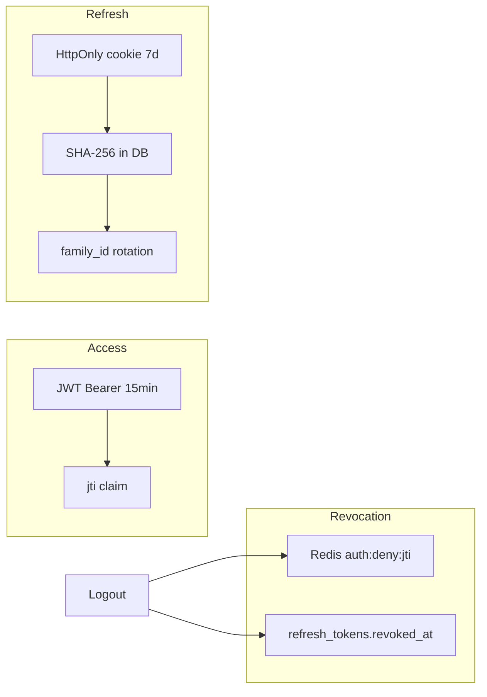

## JWT Structure (`JwtService`)

| Claim | Value |
|-------|-------|
| `sub` | userId (UUID) |
| `username` | display name |
| `jti` | unique token id for denylist |
| `iat`, `exp` | issued / expiry |

**Algorithm:** HS256 with `jwt.secret` (min 32 bytes).

## Refresh Cookie (`RefreshCookieService`)

| Attribute | Value |
|-----------|-------|
| Name | `refresh_token` |
| HttpOnly | true |
| SameSite | Lax |
| Secure | configurable (`JWT_REFRESH_COOKIE_SECURE`) |
| Path | `/api/auth` (limits cookie scope) |

## HTTP Auth Pipeline

1. `JwtAuthFilter` (before `UsernamePasswordAuthenticationFilter`)
2. Extract `Authorization: Bearer …`
3. Parse JWT via `JwtService`
4. Check `TokenDenylist.isDenied(jti)`
5. Set `UserPrincipal` in `SecurityContext`

## WebSocket Auth

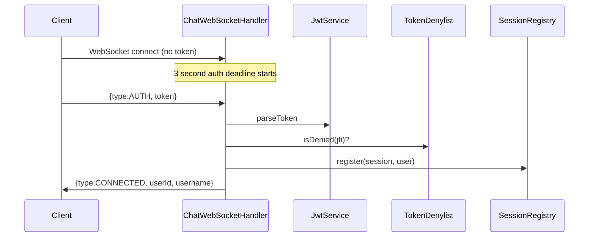

**Why post-connect AUTH?** Avoids JWT in URL query strings (proxy logs, browser history, Referer leakage).

## Authorization (Room ACL)

Enforced in `RoomService`, not Spring `@PreAuthorize`:

| Action | Required role |
|--------|---------------|
| Kick, mute, ban, invites, reports list | OWNER or MODERATOR |
| Promote, demote | OWNER only |
| Send message, read history | Any member (not banned/muted for send) |

## Session Flow (Frontend)

1. Login → store `{token, userId, username, expiresAt}` in `sessionStorage`
2. Schedule refresh 15s before expiry
3. On REST 401 → single refresh retry via `client.js`
4. Failed refresh → clear session, redirect `/login`

---

# 9. Database Deep Dive

## ER Diagram

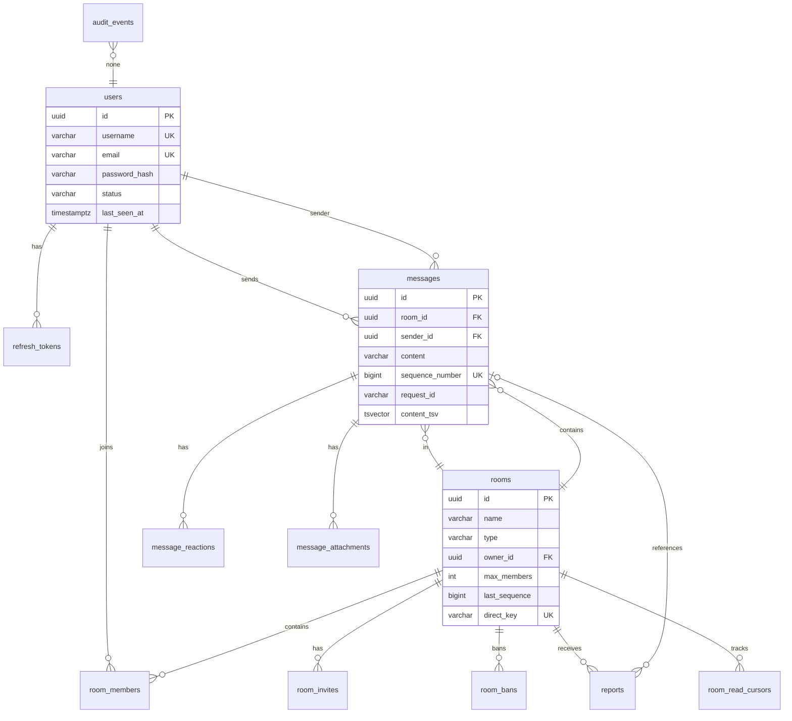

## Table Reference

### `users` (V1, V3)

| Column | Type | Purpose |
|--------|------|---------|
| `id` | UUID PK | User identity |
| `username` | VARCHAR(64) UNIQUE | Login identifier |
| `email` | VARCHAR(255) UNIQUE | Registration |
| `password_hash` | VARCHAR(255) | BCrypt hash |
| `status` | VARCHAR(32) | `ACTIVE` / inactive |
| `last_seen_at` | TIMESTAMPTZ | Presence offline timestamp (V3) |

### `rooms` (V1–V4)

| Column | Purpose |
|--------|---------|
| `last_sequence` | Monotonic message counter (V2) |
| `direct_key` | Canonical key for private DMs (V4) |
| `type` | GLOBAL, GAME_ROOM, TEAM, PARTY, PRIVATE |

**Seeded data (V4):** System user `00000000-0000-0000-0000-000000000001`, Global Lobby `00000000-0000-0000-0000-000000000010`.

### `room_members` (V1, V5)

| Column | Purpose |
|--------|---------|
| `role` | OWNER, MODERATOR, MEMBER |
| `muted` | BOOLEAN (V5) — blocks send/attach |

### `messages` (V1–V6)

| Column | Purpose |
|--------|---------|
| `sequence_number` | Per-room order; UNIQUE(room_id, sequence_number) |
| `deleted_at` | Soft delete |
| `edited_at` | Edit timestamp (5-min window) |
| `request_id` | Idempotency key |
| `content_tsv` | Generated tsvector for FTS (GIN index) |

### `refresh_tokens` (V3)

| Column | Purpose |
|--------|---------|
| `token_hash` | SHA-256 of raw refresh token |
| `family_id` | Rotation family for reuse detection |
| `revoked_at` | Null if active |

### `room_bans`, `reports`, `room_read_cursors`, `message_reactions`, `message_attachments` (V5–V6)

See migration files in `backend/src/main/resources/db/migration/`.

### `audit_events` (V7)

| Column | Purpose |
|--------|---------|
| `topic` | Kafka topic name |
| `payload` | JSONB event body |
| `created_at` | Ingest timestamp |

## Migrations (Flyway)

| Version | File | Changes |
|---------|------|---------|
| V1 | `V1__init.sql` | users, rooms, room_members, messages |
| V2 | `V2__message_sequence.sql` | sequence numbers |
| V3 | `V3__auth_refresh.sql` | refresh_tokens, last_seen_at |
| V4 | `V4__rooms_invites.sql` | invites, direct_key, Global Lobby seed |
| V5 | `V5__moderation.sql` | muted, edited_at, reports |
| V6 | `V6__v7_social.sql` | bans, read cursors, reactions, attachments, FTS |
| V7 | `V7__audit_events.sql` | audit_events |

## ORM Mapping

Hibernate entities in `auth/entity`, `room/entity`, `chat/entity`, `audit/entity`. Composite keys: `RoomMemberId`, `MessageReactionId`. `ddl-auto: validate` — schema must match Flyway exactly.

---

# 10. Redis Deep Dive

Redis is **not** a message archive. It coordinates live state and cross-node fan-out.

## Use Cases

| Use Case | Key / Channel | TTL | File |
|----------|---------------|-----|------|
| **Pub/sub fan-out** | Channel `chat.events` | — | `ChatEventPublisher`, `ChatEventListener` |
| **JWT denylist** | `auth:deny:{jti}` | Until token exp | `TokenDenylist` |
| **Send rate limit** | `ratelimit:send:{userId}` | Window seconds | `RateLimitService` |
| **Auth rate limit** | `ratelimit:auth:{clientKey}` | Window seconds | `RateLimitService` |
| **Room presence hash** | `presence:room:{roomId}` | — | `PresenceService` |
| **Connection counter** | `presence:conn:{roomId}:{userId}` | — | `PresenceService` |
| **Heartbeat** | `presence:hb:{roomId}:{userId}` | `presence-ttl-ms` (90s) | `PresenceService` |
| **User's rooms** | `presence:rooms:{userId}` | Set | `PresenceService` |
| **Global status** | `presence:user:{userId}` | — | `PresenceService` |

## Caching Strategy

**There is no read-through cache for messages or rooms.** Redis stores ephemeral coordination data only. This avoids cache invalidation complexity—Postgres is always authoritative for history.

## Cache Invalidation

Not applicable for message content. Denylist keys expire naturally at JWT `exp`. Rate limit keys expire per window. Presence keys expire via TTL + sweeper.

## Pub/Sub Flow

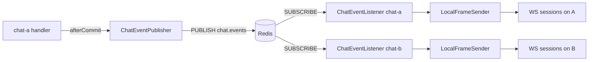

## Lua Scripts

`PresenceService` uses atomic Lua for join/leave to increment/decrement connection counts and emit OFFLINE only when count hits zero—preventing flicker when a user has multiple tabs.

## Performance Benefits

- Pub/sub latency ~sub-ms vs polling Postgres
- Rate limiting without DB writes
- O(1) denylist checks vs DB token table lookups on every request

---

# 11. Message Queue Deep Dive (Kafka)

**RabbitMQ does not exist in this repository.** Message queuing for audit uses **Apache Kafka**.

## Architecture Role

Kafka is an **append-only event log**, not a real-time delivery bus. Chat messages reach clients via Redis pub/sub, not Kafka.

## Producers

**Class:** `KafkaChatEventLog` (`backend/src/main/java/com/example/gamechat/kafka/KafkaChatEventLog.java`)

| Trigger | Topic |
|---------|-------|
| Message persisted | `chat.message.persisted` |
| User joined room (REST/WS) | `chat.user.joined` |
| User left | `chat.user.left` |
| Moderation action | `chat.moderation` |

Publishing occurs **after** `@Transactional` commit (via service layer calls, not inside Redis publisher).

## Consumers

| Listener | Group | Profile | Behavior |
|----------|-------|---------|----------|
| `ChatEventLogListener` | `gamechat-log` | Kafka enabled + `log-listener=true` | Logs JSON to stdout |
| `AuditEventListener` | `gamechat-audit` | `audit` | INSERT into `audit_events` |

In Docker compose:
- `chat-a`, `chat-b`: `KAFKA_LOG_LISTENER=false` (no stdout spam)
- `audit-consumer`: `SPRING_PROFILES_ACTIVE=audit`

## Configuration

```yaml
# application.yml
spring.kafka.bootstrap-servers: ${KAFKA_BOOTSTRAP_SERVERS:localhost:9092}
spring.kafka.listener.auto-startup: ${KAFKA_ENABLED:false}
app.kafka.enabled: ${KAFKA_ENABLED:false}
```

Docker overrides: `KAFKA_ENABLED=true`, `KAFKA_BOOTSTRAP_SERVERS=kafka:9092`.

## Acknowledgements & Retry

Spring Kafka default: auto-commit with `auto-offset-reset: latest`. No custom DLQ configured—production gap (see Section 33).

## Message Flow Diagram

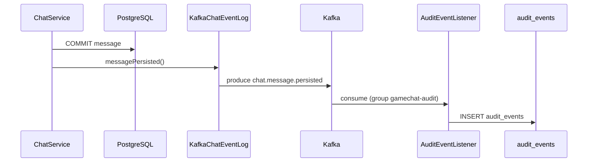

---

# 12. Docker Deep Dive

## Backend Dockerfile

**File:** `backend/Dockerfile`

| Stage | Base | Actions |
|-------|------|---------|
| **build** | `maven:3.9-eclipse-temurin-21` | Copy pom + src; `mvn -B -DskipTests package` |
| **runtime** | `eclipse-temurin:21-jre` | Copy `target/*.jar` → `app.jar`; EXPOSE 8080 |

**Runtime process:** `java -jar app.jar`

**Layer caching:** `pom.xml` copied before `src/` so dependency layer caches when only code changes.

## Frontend Dockerfile

**File:** `frontend/Dockerfile`

| Stage | Base | Actions |
|-------|------|---------|
| **build** | `node:22-alpine` | `npm ci`, `npm run build` → `dist/` |
| **runtime** | `nginx:alpine` | Copy `dist/` + `nginx.conf` |

## Gateway Dockerfile

**File:** `gateway/Dockerfile`

`nginx:alpine` + `nginx.conf` → `/etc/nginx/conf.d/default.conf`

## docker-compose.yml Services

See Section 2. Key points:

- **Shared image:** `chat-a`, `chat-b`, `audit-consumer` build same `./backend`
- **Health checks:** postgres, redis, kafka gate chat startup
- **Volumes:** `postgres_data`, `minio_data`, `loki_data`
- **Ports exposed:** 5432 (postgres), 8080 (gateway), 8081 (frontend), 3000 (grafana), 127.0.0.1:9090 (prometheus)

## Startup Order

```
1. certs-init (one-shot)
2. postgres, redis, kafka, minio (parallel)
3. minio-init (bucket create)
4. chat-a, chat-b, audit-consumer (after infra healthy)
5. gateway (after certs + chat nodes started)
6. frontend (after certs + gateway)
7. loki → promtail; chat nodes → prometheus; prometheus+loki → grafana
8. k6 (profile loadtest only, after gateway)
```

---

# 13. Nginx Deep Dive

## Gateway (`gateway/nginx.conf`)

### Global Directives

| Directive | Purpose |
|-----------|---------|
| `map $http_upgrade $connection_upgrade` | Sets `Connection: upgrade` for WebSocket |
| `log_format nowsquery` | Compact access log: IP, method, URI, status |
| `upstream chat least_conn` | Load balance to fewer-connected backend |
| `max_fails=3 fail_timeout=10s` | Temporary backend ejection on errors |

### Server Block

| Directive | Purpose |
|-----------|---------|
| `listen 80; listen 443 ssl` | Dual HTTP/HTTPS |
| `ssl_protocols TLSv1.2 TLSv1.3` | Modern TLS only |
| `add_header Strict-Transport-Security` | HSTS 1 year |
| `error_page 497` | Redirect plain HTTP to HTTPS |

### Locations

| Location | Behavior |
|----------|----------|
| `= /actuator/prometheus` | **return 404** — blocks external metric scrape |
| `/` | Reverse proxy REST to upstream; forwards Authorization, Cookie, X-Forwarded-* |
| `/ws/` | WS upgrade; 3600s read/send timeout; separate `ws.log` |

## Frontend (`frontend/nginx.conf`)

| Location | Behavior |
|----------|----------|
| Port 80 | 301 redirect to `https://$host:8081$request_uri` |
| `/` | SPA: `try_files $uri $uri/ /index.html` |
| `/api/` | Dynamic proxy to `http://gateway` via Docker DNS resolver |
| `/ws/` | WS proxy to gateway |
| `/actuator/health` | Health passthrough for UI monitoring |

**Request flow (UI user):**

```
Browser → frontend:443 (TLS) → [static | proxy gateway:80] → chat-a|chat-b:8080
```

---

# 14. Configuration Files

## `.env.example`

| Variable | Default | Purpose | Security |
|----------|---------|---------|----------|
| `POSTGRES_USER` | gamechat | DB user | Change in prod |
| `POSTGRES_PASSWORD` | gamechat | DB password | **Secret** — never commit `.env` |
| `POSTGRES_DB` | gamechat | Database name | — |
| `REDIS_HOST` | localhost | Local dev only; compose uses `redis` | — |
| `REDIS_PORT` | 6379 | Redis port | — |
| `JWT_SECRET` | dev placeholder | HS256 signing key | **Critical secret** — ≥32 chars |
| `JWT_ACCESS_EXPIRATION` | 900000 | 15 min access TTL | Tune for security UX tradeoff |
| `JWT_REFRESH_EXPIRATION` | 604800000 | 7 day refresh TTL | — |
| `JWT_REFRESH_COOKIE_SECURE` | true | Secure cookie flag | Set false only for local HTTP dev |
| `PROM_USER` | prom | Prometheus scrape auth | Restrict network (127.0.0.1 bind) |
| `PROM_PASSWORD` | prompass | Prometheus scrape auth | **Secret** |
| `MINIO_ROOT_USER` | minio | Object store credentials | **Secret** in prod |
| `MINIO_ROOT_PASSWORD` | minio12345 | Object store credentials | **Secret** in prod |

## `application.yml` (Backend)

Full property reference in Section 3 agent report. Key runtime behaviors:

| Property | Runtime effect |
|----------|----------------|
| `server.forward-headers-strategy: framework` | Trust X-Forwarded-* from nginx |
| `spring.jpa.open-in-view: false` | Prevents lazy-load outside transactions |
| `app.chat.send-rate-limit: 20` | Max 20 messages per 10s per user |
| `app.chat.sync-batch-size: 100` | WS HISTORY_SYNC cap |
| `app.chat.heartbeat-timeout-ms: 60000` | WS idle disconnect |

## `application-audit.yml`

Minimal profile overlay for audit consumer (Kafka listener config).

## Observability Configs

| File | Purpose |
|------|---------|
| `observability/prometheus.yml` | Scrape chat-a/b every 10s with basic auth |
| `observability/loki/loki.yml` | Single-node Loki filesystem storage |
| `observability/promtail/promtail.yml` | Docker SD filter for chat/gateway/frontend/audit |
| `observability/grafana/provisioning/*` | Auto-provision datasources + dashboard |

---

# 15. Codebase Design Patterns

| Pattern | Where | Why | Interview explanation |
|---------|-------|-----|----------------------|
| **Repository** | `*Repository` JPA interfaces | Decouple persistence from services | "Services depend on interfaces; Spring Data generates queries." |
| **Strategy** | `ObjectStore`, `ChatEventLog` | Swap S3/local, Kafka/no-op via `@ConditionalOnProperty` | "Same service code, different infra backends selected at startup." |
| **Publisher-Subscriber** | Redis `chat.events` | Cross-node WS fan-out | "Each node subscribes; events reach all nodes without direct coupling." |
| **Facade** | `ChatService` over `MessageService` | Simplifies WS handler | "Handler calls one service; orchestration hidden inside." |
| **DTO (Records)** | `*Request`, `*Response` | API contract isolation | "Entities never leak to REST/WS boundary." |
| **Filter Chain** | `JwtAuthFilter`, `SecurityConfig` | Cross-cutting auth | "Spring Security composable filters before controllers." |
| **Template Method** | Spring `@Transactional` + `publishAfterCommit` | Consistency | "Redis publish only after DB commit succeeds." |
| **Registry** | `SessionRegistry` | In-memory WS session index | "Fast room→sessions lookup on each node." |
| **Sweeper (Scheduled)** | `PresenceSweeper`, `WebSocketHeartbeatSweeper` | Background cleanup | "Periodic tasks for TTL enforcement without blocking requests." |
| **Global Exception Handler** | `GlobalExceptionHandler` | Uniform error JSON | "ApiException → ErrorResponse mapping." |

**Not used:** Singleton (explicit), Builder (records used instead), Observer (Spring events not used for chat—Redis instead).

---

# 16. SOLID Principles

## Single Responsibility (SRP) — **Mostly followed**

| Good | Example |
|------|---------|
| ✅ | `JwtService` only handles JWT create/parse |
| ✅ | `RateLimitService` only rate limits |
| ✅ | `LocalFrameSender` only writes WS frames |

| Gap | Example |
|-----|---------|
| ⚠️ | `RoomService` handles membership, moderation, invites, read cursors—large but cohesive domain |

## Open/Closed (OCP) — **Followed via interfaces**

- `ObjectStore` / `ChatEventLog` extended without modifying consumers
- `@ConditionalOnProperty` beans swap implementations

## Liskov Substitution (LSP) — **Followed**

- `S3ObjectStore` and `LocalObjectStore` interchangeable where `ObjectStore` injected
- `NoOpChatEventLog` satisfies `ChatEventLog` contract when Kafka off

## Interface Segregation (ISP) — **Adequate**

- Small focused interfaces: `ObjectStore`, `ChatEventLog`
- JPA repositories per aggregate

## Dependency Inversion (DIP) — **Followed**

- Services depend on repository interfaces and abstractions, not concrete JDBC
- Spring constructor injection throughout

---

# 17. Folder-by-Folder Deep Dive

## Root

| Path | Responsibility | Interfaces | Lifecycle |
|------|----------------|------------|-----------|
| `docker-compose.yml` | Orchestration | Docker Compose CLI | `up`/`down` |
| `.env.example` | Config template | Copy to `.env` | Manual |
| `README.md`, `API.md` | Documentation | Human readers | Static |

## `backend/src/main/java/com/example/gamechat/auth/`

| Subfolder | Responsibility |
|-----------|----------------|
| `controller/` | REST auth endpoints; cookie handling |
| `dto/` | RegisterRequest, LoginRequest, AuthResponse records |
| `entity/` | User, RefreshToken JPA entities |
| `repository/` | Spring Data JPA queries |
| `security/` | JWT, filters, SecurityConfig, denylist, cookies |
| `service/` | AuthService business logic |

**Dependencies:** → `room.service`, `chat.service.RateLimitService`, Redis, Postgres

## `backend/.../room/`

| Subfolder | Responsibility |
|-----------|----------------|
| `controller/` | 18 REST endpoints for rooms/moderation |
| `dto/` | Room/member/report request/response records |
| `entity/` | Room, RoomMember, RoomInvite, RoomBan, Report, RoomReadCursor |
| `repository/` | JPA + custom queries (unread counts) |
| `service/` | RoomService — all room domain rules |

## `backend/.../chat/`

| Subfolder | Responsibility |
|-----------|----------------|
| `controller/` | Message history, attachments, presence REST |
| `dto/` | MessageResponse, SyncBatch, etc. |
| `entity/` | Message, MessageReaction, MessageAttachment |
| `repository/` | FTS search, sequence queries |
| `service/` | ChatService, MessageService, PresenceService, RateLimitService, AttachmentService, metrics, sweepers |
| `bus/` | Redis pub/sub event model |
| `websocket/` | WS handler, config, session registry, heartbeat |

## `backend/.../kafka/`

Event log abstraction + Kafka producer + optional stdout consumer + enable config.

## `backend/.../audit/`

Kafka consumer → `audit_events` table (profile-gated).

## `backend/.../storage/`

`ObjectStore` interface + local/S3 implementations.

## `backend/.../common/`

Shared `PageResponse`, `ApiException`, `GlobalExceptionHandler`.

## `backend/src/main/resources/db/migration/`

Flyway SQL — sole schema authority.

## `backend/src/test/`

Unit tests (`*Test.java`) + integration (`ChatApplicationIT`, `KafkaChatEventIT`) using Testcontainers.

## `frontend/src/api/`

| File | REST module |
|------|-------------|
| `client.js` | fetch wrapper, 401 refresh retry, traffic logging |
| `auth.js` | register, login, refresh, logout |
| `rooms.js` | all room endpoints |
| `messages.js` | history, search, upload |
| `health.js` | `/actuator/health` (unused in UI) |
| `trafficLog.js` | traffic log helpers |

## `frontend/src/auth/`

`AuthContext.jsx` — session lifecycle, refresh timer.

## `frontend/src/chat/`

`ChatContext.jsx` — largest frontend module: WS events, room state, messages map, moderation actions.

## `frontend/src/components/`

Presentational + container components for chat UI.

## `frontend/src/pages/`

Route-level pages: Login, Register, Chat.

## `frontend/src/ws/`

`chatSocket.js` — WebSocket connection, AUTH, ping, frame API.

## `gateway/`

Single nginx config + Dockerfile — no application code.

## `certs/`

`generate.sh` — OpenSSL CA + server cert with SANs for Docker hostnames.

## `observability/`

Prometheus, Loki, Promtail, Grafana, k6 configs.

---

# 18. Important Classes Explained

## JwtService

**File:** `auth/security/JwtService.java`

| | |
|---|---|
| **Responsibility** | Create and parse HS256 JWTs |
| **Fields** | `secretKey`, `expirationMs` from config |
| **Methods** | `createToken(User)`, `parseToken(String)` → claims |
| **Interactions** | Used by AuthService, JwtAuthFilter, ChatWebSocketHandler |

## JwtAuthFilter

**File:** `auth/security/JwtAuthFilter.java`

| | |
|---|---|
| **Responsibility** | Once-per-request Bearer extraction |
| **Algorithm** | Parse → denylist check → set SecurityContext |
| **Side effects** | None on DB; Redis read for denylist |

## ChatWebSocketHandler

**File:** `chat/websocket/ChatWebSocketHandler.java`

| | |
|---|---|
| **Responsibility** | All WS frame routing |
| **Fields** | Injected services (Chat, Message, Presence, JWT, Room, etc.) |
| **Methods** | `handleTextMessage`, `handleAuth`, `handleJoin`, `handleSend`, … |
| **Interactions** | SessionRegistry, ChatEventPublisher, JwtService |

## SessionRegistry

**File:** `chat/websocket/SessionRegistry.java`

| | |
|---|---|
| **Responsibility** | In-memory maps: session→user, user→sessions, room→sessions |
| **Metrics** | Registers Micrometer gauge `chat.ws.connections` |
| **Thread safety** | Concurrent structures for multi-threaded WS I/O |

## RoomService

**File:** `room/service/RoomService.java`

| | |
|---|---|
| **Responsibility** | All room domain rules (~800+ lines) |
| **Key methods** | `createRoom`, `join`, `leave`, `kick`, `ban`, `resolveReport`, `getUnreadCount` |
| **Interactions** | All room repos, ChatEventPublisher, ChatEventLog |

## MessageService

**File:** `chat/service/MessageService.java`

| | |
|---|---|
| **Responsibility** | Persistence, sequences, reactions, search |
| **Key methods** | `persistMessage`, `syncAfter`, `search`, `addReaction` |
| **Locking** | `findByIdForUpdate` on room row |

## PresenceService

**File:** `chat/service/PresenceService.java`

| | |
|---|---|
| **Responsibility** | Redis-backed presence with Lua atomicity |
| **Key methods** | `joinRoom`, `leaveRoom`, `setStatus`, `getSnapshot` |

## ChatEvent / ChatEventKind

**File:** `chat/bus/ChatEvent.java`

Typed enum of event kinds: `MESSAGE`, `TYPING`, `PRESENCE`, `REACTION`, `READ`, `DELIVERY`, `MESSAGE_DELETED`, `MESSAGE_EDITED`, `DROP_USER`.

## Class Relationship Diagram

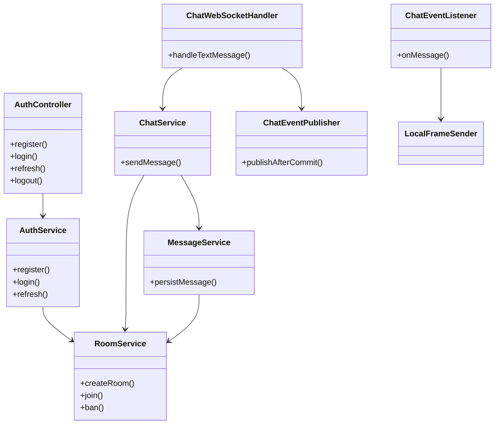

---

# 19. Important Functions Explained

## `AuthService.issue(User, UUID familyId)`

| | |
|---|---|
| **Input** | User entity, refresh family UUID |
| **Output** | `IssuedAuth` with access token, raw refresh, AuthResponse |
| **Side effects** | INSERT refresh_tokens, JWT creation |
| **Algorithm** | Generate raw refresh = UUID+UUID; SHA-256 hash stored |
| **Complexity** | O(1) DB writes |

## `MessageService.persistMessage(...)`

| | |
|---|---|
| **Input** | roomId, senderId, content, optional requestId |
| **Output** | Message entity with assigned sequenceNumber |
| **Side effects** | UPDATE rooms.last_sequence, INSERT messages |
| **Algorithm** | Pessimistic lock room → check idempotency → increment sequence |
| **Complexity** | O(1) with index; lock serializes per room |

## `RateLimitService.checkSend(userId)`

| | |
|---|---|
| **Input** | userId UUID string |
| **Output** | void or throws ApiException (429) |
| **Side effects** | Redis INCR with EXPIRE |
| **Algorithm** | Fixed window counter |
| **Complexity** | O(1) |

## `ChatEventPublisher.publishAfterCommit(event)`

| | |
|---|---|
| **Input** | ChatEvent record |
| **Output** | void |
| **Side effects** | Redis PUBLISH after transaction commit |
| **Algorithm** | Spring TransactionSynchronization callback |
| **Complexity** | O(1) + serialization |

## `PresenceService` Lua JOIN_SCRIPT

| | |
|---|---|
| **Input** | roomId, userId, status keys |
| **Output** | connection count after join |
| **Side effects** | Multiple Redis keys updated atomically |
| **Complexity** | O(1) atomic |

## `ChatContext.selectRoom(roomId)` (Frontend)

| | |
|---|---|
| **Input** | room UUID |
| **Output** | Updates React state, navigates URL |
| **Side effects** | REST fetches + WS JOIN_ROOM + MARK_READ |
| **Algorithm** | Sequential: get room → members → messages page 0 → WS join |

---

# 20. Middleware Flow

## Spring Security Filter Order

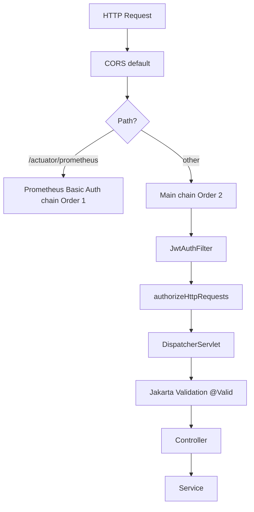

## Execution Order (Main Chain)

1. **CSRF disabled** — stateless JWT API
2. **SessionCreationPolicy.STATELESS** — no HTTP session
3. **JwtAuthFilter** — Bearer parsing (skipped for permitAll paths)
4. **Authorization rules** — permit auth/health/ws; authenticate `/api/**`
5. **Exception handlers** — JSON ErrorResponse on 401/403
6. **Controller validation** — `@Valid` on request bodies
7. **Service layer** — business rules, `@Transactional`

## WebSocket "Middleware"

Not servlet filters—handled in `ChatWebSocketHandler`:

1. Parse JSON → validate `type`
2. Check `session.authenticated` (except AUTH, PING)
3. Route to handler method
4. Catch exceptions → ERROR frame

## Frontend Middleware (`client.js`)

1. Attach Bearer from session
2. `credentials: "include"` for cookies
3. On 401 → call refresh handler → retry once
4. Log to TrafficLog (redact secrets)

## CORS

No explicit CORS config—same-origin via frontend nginx proxy. Direct API calls to `:8080` from another origin would be blocked by browser unless CORS added.

## Rate Limiting

Not servlet middleware—invoked inside `AuthService` and `ChatService` via `RateLimitService`.

---

# 21. Error Handling

## REST Errors

**Format:** `ErrorResponse` record

```json
{ "code": "FORBIDDEN", "message": "Not a member of this room", "status": 403 }
```

| Component | Role |
|-----------|------|
| `ApiException` | Typed exceptions with HTTP status + code |
| `GlobalExceptionHandler` | `@RestControllerAdvice` maps exceptions |
| `SecurityConfig` entry points | 401/403 JSON for auth failures |
| `@Valid` failures | 400 `VALIDATION_ERROR` with field details |

## WebSocket Errors

**Format:** `{ type: "ERROR", code, message, requestId }`

Socket stays open (except heartbeat/auth timeout closes).

## Retries

| Layer | Retry behavior |
|-------|----------------|
| Frontend REST | Single refresh + retry on 401 |
| Frontend WS | Exponential backoff reconnect 1s→15s |
| Kafka | Spring default; no app-level retry |
| Redis publish | Log error; no retry (potential lost fan-out—gap) |

## Logging

SLF4J throughout; errors logged in catch blocks (e.g., Redis publish failure in `ChatEventPublisher`).

## User-facing vs Internal

| User-facing | Internal |
|-------------|----------|
| ApiException messages | Stack traces in logs only |
| WS ERROR frames | `INTERNAL_ERROR` generic message |
| 401 "Authentication required" | Jwt parse exceptions logged server-side |

---

# 22. Logging System

## Logger Initialization

Standard Spring Boot Logback (default). No custom logback.xml in repo—defaults apply.

## Log Levels

| Level | Usage |
|-------|-------|
| ERROR | Redis publish failures, serialization errors |
| INFO | Spring Boot startup, Kafka listener registration |
| DEBUG | Not widely used in application code |

## Structured Logging

**Not implemented** — plain text logs. Loki/Promtail collect container stdout.

## Correlation IDs

**Not implemented** — no `X-Request-ID` or MDC tracing across REST→DB→Redis→WS.

## Observability Pipeline

```
Container stdout → Docker → Promtail → Loki → Grafana dashboard logs panel
```

Promtail filters containers: `chat-a`, `chat-b`, `gateway`, `frontend`, `audit-consumer`.

## Metrics (Micrometer)

| Metric | Type | Source |
|--------|------|--------|
| `chat.messages.sent` | Counter | ChatMetrics |
| `chat.ws.connections` | Gauge | SessionRegistry |
| HTTP, JVM, Redis, Kafka | Auto | Spring Boot Actuator |

---

# 23. Security Review

## JWT Security

| Control | Status | Notes |
|---------|--------|-------|
| Short TTL (15 min) | ✅ | Limits exposure |
| Refresh rotation | ✅ | Family revocation on reuse |
| Denylist on logout | ✅ | Redis TTL aligned to exp |
| HS256 symmetric | ⚠️ | Fine for monolith; RS256 for multi-service |
| Secret in env | ⚠️ | Dev default in repo—must override prod |
| WS post-connect auth | ✅ | No query string leakage |

## SQL Injection

| Control | Status |
|---------|--------|
| JPA parameterized queries | ✅ |
| Flyway migrations | ✅ |
| No raw string concatenation in queries | ✅ |

## XSS

| Control | Status |
|---------|--------|
| React escapes text by default | ✅ |
| Message content rendered as text | ✅ (verify no dangerouslySetInnerHTML) |
| Attachment inline display | ⚠️ — Content-Disposition inline; trust content-type |

## CSRF

| Control | Status |
|---------|--------|
| CSRF disabled | ✅ for stateless JWT API |
| SameSite=Lax refresh cookie | ✅ mitigates cross-site cookie send |

## CORS

Not configured—same-origin proxy pattern. Add explicit CORS if SPA hosted separately.

## Secrets Management

| Issue | Recommendation |
|-------|----------------|
| `.env` gitignored but defaults weak | Use secrets manager in prod |
| MinIO/Prometheus creds in compose | Rotate; restrict network |
| JWT secret in application.yml default | Fail startup if default detected in prod |

## Password Hashing

BCrypt via `PasswordEncoder` bean — industry standard.

## Suggested Improvements

1. Add correlation IDs across REST and WS
2. RS256 JWT with key rotation
3. Content Security Policy headers in nginx
4. Rate limit at gateway (nginx limit_req) as defense in depth
5. Kafka DLQ for failed audit writes
6. Fail-fast if `JWT_SECRET` equals dev placeholder in production profile

---

# 24. Performance Analysis

## Bottlenecks

| Area | Risk | Detail |
|------|------|--------|
| **Room row lock** | Medium | Every message locks room for sequence—serializes writes per room |
| **Redis pub/sub** | Low | Fire-and-forget; failure loses fan-out |
| **HISTORY_SYNC** | Medium | Up to 100 messages on JOIN; large gaps need REST pagination |
| **Member list + presence** | Low | O(members) snapshot on join |

## Expensive Queries

| Query | Cost |
|-------|------|
| FTS search | GIN index helps; still scans matching rows |
| Room list with unread | Join room_members + read cursors + last_sequence |
| Message history page | Index `(room_id, created_at DESC)` |

## Unnecessary API Calls

| Issue | Location |
|-------|----------|
| `refreshRooms` on many WS events | ChatContext — could debounce |
| Full member fetch on room select | Acceptable for small rooms |

## Memory-Heavy Operations

| Operation | Impact |
|-----------|--------|
| SessionRegistry | Grows with connected WS clients per node |
| ChatContext messages Map | All loaded messages in React state per room |
| HISTORY_SYNC batch | Up to 100 messages deserialized at once |

## Network Overhead

- Double proxy (frontend → gateway → chat) adds latency ~1–2ms in Docker
- WS MESSAGE fan-out: 1 Redis publish + N local sends per node

## Optimizations

1. Virtual threads (Java 21) for blocking I/O heavy workloads
2. Paginate member list for large GAME_ROOM
3. Debounce room list refresh
4. Consider Redis Streams with consumer groups for guaranteed fan-out
5. CDN for frontend static assets in production

---

# 25. Scalability Analysis

## Horizontal Scaling

| Component | Scalable? | Mechanism |
|-----------|-----------|-----------|
| chat-a/b | ✅ | Add chat-c,d… behind nginx upstream |
| gateway | ✅ | Multiple gateway instances + external LB |
| postgres | ⚠️ | Single instance in compose; read replicas for history |
| redis | ⚠️ | Single instance; Cluster for HA |
| kafka | ✅ | Increase partitions/brokers |
| frontend | ✅ | Static assets; CDN |

## Stateless Services

| Service | Stateless? |
|---------|--------------|
| REST handlers | ✅ — JWT in header |
| WS handlers | ❌ — SessionRegistry in-memory per node |
| Redis pub/sub | ✅ — bridges WS state across nodes |

## Load Balancing

Gateway uses `least_conn` — appropriate for long-lived WS connections.

**No sticky sessions required** because Redis fan-out delivers messages to all nodes.

## Caching

No application-level read cache. At 100x traffic, consider:
- Redis cache for room metadata
- Read replicas for message history

## Queue Scaling

Kafka partitions keyed by roomId — scale consumers per topic.

## "What Happens If Traffic Becomes 100x?"

| Component | Failure mode | Mitigation |
|-----------|--------------|------------|
| Postgres | Connection pool exhaustion, write latency | PgBouncer, sharding by roomId, CQRS for history |
| Redis | Pub/sub bandwidth, single-threaded CPU | Redis Cluster, dedicated pub/sub instances |
| Chat nodes | CPU for WS JSON parsing | More nodes, binary protocol (Protobuf) |
| Room lock | Serial write bottleneck per hot room | Sequence service (Redis INCR) decoupled from room row |
| Kafka | Producer backpressure | Async buffer, monitor lag |
| nginx | Connection limit | Multiple gateways, kernel tuning |

---

# 26. CI/CD Pipeline

## Status: **Does Not Exist**

There is **no** `.github/workflows/`, GitLab CI, Jenkinsfile, or other CI/CD configuration in this repository.

## Current Manual Pipeline

| Step | Command | Purpose |
|------|---------|---------|
| Build & run | `docker compose up --build` | Full stack build and deploy locally |
| Backend tests | `mvn test` (in Docker with Testcontainers) | Unit + integration |
| Load test | `docker compose --profile loadtest run --rm k6` | Manual performance validation |

## Recommended CI Pipeline (Not Implemented)

```yaml
# Hypothetical GitHub Actions
on: [push, pull_request]
jobs:
  test:
    runs-on: ubuntu-latest
    steps:
      - uses: actions/checkout@v4
      - uses: actions/setup-java@v4
        with: { java-version: '21' }
      - run: cd backend && mvn test
      - run: cd frontend && npm ci && npm run build
  integration:
    runs-on: ubuntu-latest
    steps:
      - run: docker compose up -d --wait
      - run: curl -k https://localhost:8080/actuator/health
```

---

# 27. Testing Strategy

## Unit Tests (`*Test.java`)

| Test | File | Coverage |
|------|------|----------|
| JWT create/parse | `JwtServiceTest` | Token claims, expiry |
| Auth flows | `AuthServiceTest` | Register, login, refresh, logout, family revoke |
| Messages | `MessageServiceTest` | Persist, reactions, search, edit window |
| Presence | `PresenceServiceTest` | Redis join/leave (Testcontainers Redis) |
| Rate limits | `RateLimitServiceTest` | Auth/send windows |
| Session registry | `SessionRegistryTest` | Room subscribe/unsubscribe |
| Redis listener | `ChatEventListenerTest` | Event deserialization |
| Room domain | `RoomServiceTest` | Create, join, moderation |
| Kafka producer | `KafkaChatEventLogTest` | Mocked KafkaTemplate |

## Integration Tests

| Test | File | Scope |
|------|------|-------|
| `ChatApplicationIT` | Full Spring context + Testcontainers Postgres/Redis | REST + WS E2E |
| `KafkaChatEventIT` | Testcontainers Kafka | Event production/consumption |

## Test Configuration

**File:** `backend/src/test/resources/application.yml`

- Kafka disabled by default
- Relaxed rate limits
- `JWT_REFRESH_COOKIE_SECURE: false`

## Mocks

- `@MockBean` for Kafka in unit tests
- Testcontainers for real Postgres, Redis, Kafka in integration tests

## Frontend Tests

**None** — no Jest/Vitest/Playwright tests in `frontend/`.

## Missing Tests

| Gap | Priority |
|-----|----------|
| Frontend component tests | High |
| WebSocket protocol integration (multi-frame sequences) | Medium |
| Attachment upload E2E | Medium |
| nginx/gateway routing tests | Low |
| Audit consumer profile IT | Medium |
| Load/regression in CI | High |
| Security tests (token reuse, ban bypass) | High |

---

# 28. Complete Feature Walkthroughs

## 28.1 Login

| Layer | Flow |
|-------|------|
| **UI** | LoginPage → AuthContext.login → POST /api/auth/login |
| **API** | AuthController → AuthService.login |
| **DB** | SELECT user; auto-join Global Lobby |
| **Cache** | Redis auth rate limit check |
| **Queue** | None |
| **Response** | accessToken + refresh cookie → sessionStorage |

## 28.2 Register

Same as login plus INSERT user, uniqueness checks, 201 status.

## 28.3 Create Room & Chat

| Step | Component |
|------|-----------|
| 1 | POST /api/rooms → RoomService.createRoom |
| 2 | WS connect → AUTH → CONNECTED |
| 3 | POST /api/rooms/{id}/join (if not owner) |
| 4 | WS JOIN_ROOM → HISTORY_SYNC → JOINED |
| 5 | WS SEND_MESSAGE → Postgres INSERT → Redis PUBLISH → MESSAGE |

## 28.4 Notification (Live Message Delivery)

Not a separate notification service—real-time delivery IS the chat MESSAGE frame via Redis fan-out.

## 28.5 Moderation (Ban)

| Step | Action |
|------|--------|
| 1 | POST ban → INSERT room_bans, DELETE room_members |
| 2 | ChatEventPublisher DROP_USER or kick handling |
| 3 | Kafka chat.moderation event |
| 4 | Banned user join attempt → 403 |

## 28.6 Attachment

| Step | Action |
|------|--------|
| 1 | POST multipart → AttachmentService |
| 2 | ObjectStore.put → MinIO |
| 3 | INSERT message + message_attachments |
| 4 | GET /api/attachments/{id} → stream with membership check |

## 28.7 Unread Badges

| Step | Action |
|------|--------|
| 1 | WS MARK_READ → UPDATE room_read_cursors |
| 2 | Broadcast READ frame |
| 3 | GET /api/rooms includes unreadCount per room |

## 28.8 Search

GET search?q= → Postgres FTS → paginated results in UI.

---

# 29. Sequence Diagrams

## Login

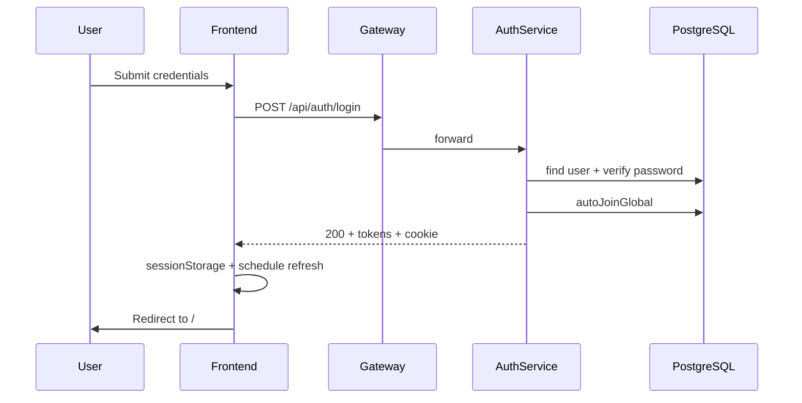

## Signup (Register)

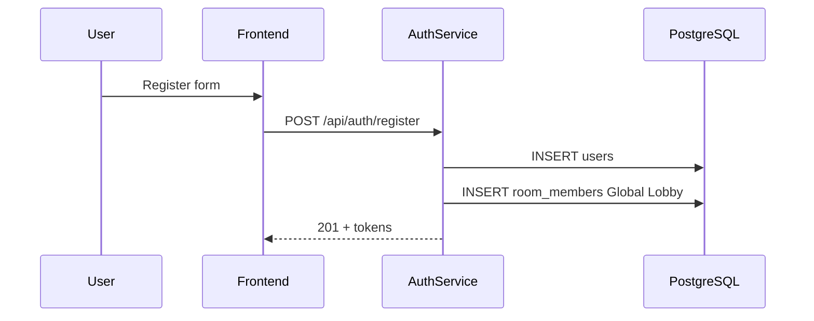

## Live Message (Notification)

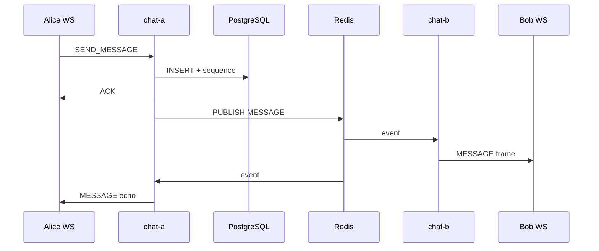

## Queue Processing (Kafka Audit)

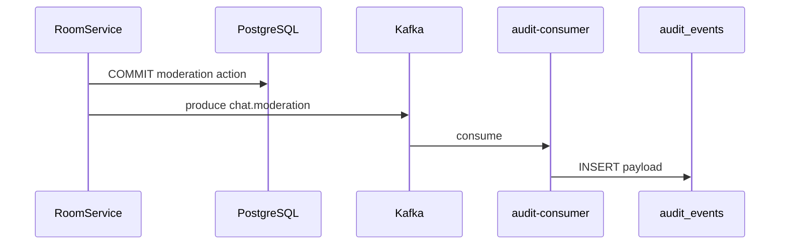

## Cache Hit (Denylist)

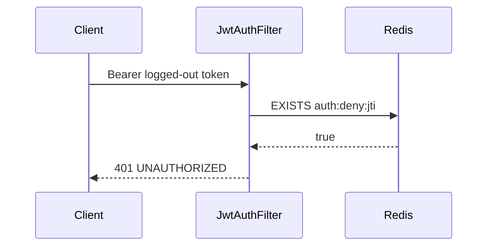

## Cache Miss (Denylist)

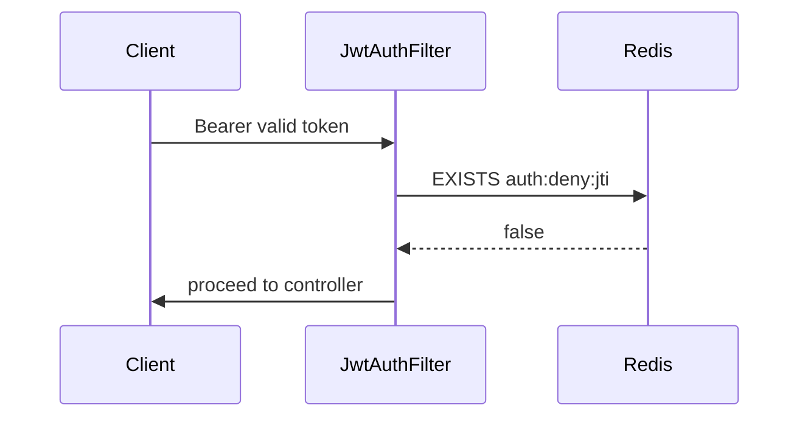

## Database Write (Send Message)

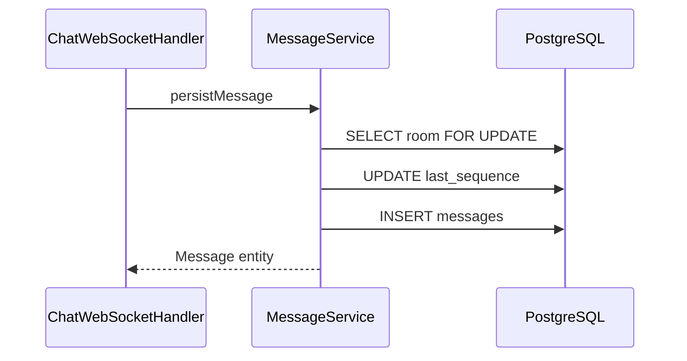

---

# 30. Interview Preparation

Questions and model answers based **only** on this repository.

---

## Beginner (20 Questions)

### B1. What does this project do?

**Answer:** It's a real-time game chat service with REST + WebSocket APIs, room-based messaging, presence, moderation, and a React UI. It runs as Docker containers with two scalable chat backend nodes.

### B2. What database does it use?

**Answer:** PostgreSQL 16 with Flyway migrations. Hibernate validates schema but does not auto-create tables.

### B3. How do users authenticate?

**Answer:** Short-lived JWT access tokens in the `Authorization: Bearer` header plus an HttpOnly refresh cookie for token renewal.

### B4. What port is the UI on?

**Answer:** `https://localhost:8081` (frontend nginx with TLS).

### B5. What port is the API gateway?

**Answer:** `https://localhost:8080` (gateway nginx terminating TLS and load-balancing to chat-a/chat-b).

### B6. How do you send a chat message?

**Answer:** Via WebSocket frame `{ type: "SEND_MESSAGE", roomId, content }` to `/ws/chat` after AUTH—not via REST.

### B7. What room types exist?

**Answer:** GLOBAL, GAME_ROOM, TEAM, PARTY, PRIVATE—each with different join rules documented in API.md.

### B8. What is the Global Lobby?

**Answer:** A seeded GLOBAL room (UUID `…0010`) that every user is auto-joined to on register/login. Cannot leave.

### B9. What is Redis used for?

**Answer:** Pub/sub for cross-node message fan-out, presence tracking, rate limiting, and JWT denylist—not primary message storage.

### B10. What is Kafka used for?

**Answer:** Post-commit event logging to topics like `chat.message.persisted` and an audit consumer that writes to `audit_events` table.

### B11. How do you start the project?

**Answer:** `cp .env.example .env` then `docker compose up --build`.

### B12. What framework is the backend?

**Answer:** Spring Boot 3.4.5 on Java 21.

### B13. What frontend framework is used?

**Answer:** React 18 with Vite 6 and React Router 6.

### B14. Where are API docs?

**Answer:** `API.md` in the repo root with curl examples and WebSocket protocol.

### B15. What is the WebSocket endpoint?

**Answer:** `/ws/chat` — custom JSON protocol, not STOMP.

### B16. How does WebSocket authentication work?

**Answer:** Connect without token; send `{ type: "AUTH", token }` within ~3 seconds; receive CONNECTED.

### B17. What happens on logout?

**Answer:** Refresh token family revoked, access token jti added to Redis denylist, cookie cleared.

### B18. What is MinIO used for?

**Answer:** S3-compatible object storage for file attachments when `S3_ENABLED=true` in Docker.

### B19. Where is Grafana?

**Answer:** `http://localhost:3000` with anonymous viewer access and a Game Chat dashboard.

### B20. How are passwords stored?

**Answer:** BCrypt hashes in `users.password_hash`—never plaintext.

---

## Intermediate (30 Questions)

### I1. Why two chat nodes?

**Answer:** To demonstrate horizontal scaling: WebSocket state is local, but Redis pub/sub broadcasts MESSAGE events so users on different nodes still receive live chat.

### I2. Explain `publishAfterCommit`.

**Answer:** In `ChatEventPublisher`, Redis publish registers a transaction synchronization callback so fan-out only happens after Postgres commit—preventing clients from seeing messages that could roll back.

### I3. How are message sequence numbers assigned?

**Answer:** Pessimistic lock on room row (`findByIdForUpdate`), increment `rooms.last_sequence`, assign to new message. Unique index on `(room_id, sequence_number)`.

### I4. What is `requestId` idempotency?

**Answer:** Client sends optional `requestId` on SEND_MESSAGE. Unique partial index on `(room_id, sender_id, request_id)` prevents duplicate rows on retry.

### I5. Explain refresh token rotation.

**Answer:** On refresh, current token is revoked, new token issued in same `family_id`. Reusing an old/revoked token revokes the entire family (reuse detection).

### I6. Why is `/actuator/prometheus` blocked on gateway?

**Answer:** Gateway returns 404 for external requests; Prometheus scrapes chat nodes directly on internal Docker network with basic auth, bound to 127.0.0.1:9090.

### I7. How does nginx load balance WebSockets?

**Answer:** `least_conn` upstream to chat-a and chat-b with Upgrade headers and 3600s timeouts. No sticky sessions needed due to Redis fan-out.

### I8. What roles exist in a room?

**Answer:** OWNER, MODERATOR, MEMBER—with different permissions for kick/mute/ban/promote.

### I9. How does presence work?

**Answer:** Redis keys track per-room connection counts and user status. Lua scripts atomically join/leave. `PresenceSweeper` marks AWAY after idle. OFFLINE when count hits zero.

### I10. What is HISTORY_SYNC?

**Answer:** On JOIN_ROOM, server sends missed messages with sequence > afterSequence, capped at `sync-batch-size` (100). If truncated, client uses REST sync.

### I11. How does full-text search work?

**Answer:** Generated `tsvector` column `content_tsv` with GIN index. Search uses `plainto_tsquery('simple', q)`.

### I12. What files can be attached?

**Answer:** Images (png/jpeg/webp/gif) or PDF, max 5MB multipart, validated in AttachmentService.

### I13. Can muted users send messages?

**Answer:** No—muted members get 403 on send and attach.

### B14. What is the audit-consumer?

**Answer:** Same backend JAR with `SPRING_PROFILES_ACTIVE=audit`. Consumes Kafka topics into `audit_events` JSONB table.

### I15. Explain the frontend refresh timer.

**Answer:** AuthContext stores `expiresAt = now + expiresIn - 15000` and schedules refresh 15 seconds before access token expiry.

### I16. What does SessionRegistry track?

**Answer:** In-memory mapping of WebSocket sessions to users and subscribed rooms on each node—enables LocalFrameSender to push frames.

### I17. What happens when a user is kicked?

**Answer:** Room membership removed, WS sessions dropped from room broadcast list via Redis DROP_USER event, Kafka moderation log.

### I18. Why Flyway instead of Hibernate ddl-auto update?

**Answer:** Versioned, reviewable SQL migrations; `ddl-auto: validate` catches entity/schema drift at startup.

### I19. How are errors returned from REST?

**Answer:** JSON `ErrorResponse` with code, message, status via GlobalExceptionHandler and Security entry points.

### I20. What metrics are custom-defined?

**Answer:** `chat.messages.sent` counter and `chat.ws.connections` gauge via ChatMetrics and SessionRegistry.

### I21. Explain PRIVATE room creation.

**Answer:** POST /api/rooms/private with peer userId. Uses canonical `direct_key` so repeated calls return same DM room.

### I22. What is the difference between LEAVE_ROOM (WS) and POST leave (REST)?

**Answer:** WS LEAVE_ROOM only unsubscribes socket from broadcasts. REST leave removes membership entirely.

### I23. How does the frontend proxy API calls?

**Answer:** frontend nginx `/api/` → `http://gateway` with Docker DNS resolver—same-origin from browser perspective.

### I24. What Testcontainers are used?

**Answer:** PostgreSQL, Redis, and Kafka containers for integration tests.

### I25. What is `open-in-view: false`?

**Answer:** Disables OSIV pattern—lazy associations won't load outside service @Transactional boundaries, preventing N+1 in views and accidental queries.

### I26. How does typing indicator work?

**Answer:** WS TYPING frame broadcast via Redis to room subscribers excluding sender; not persisted; 3s idle TTL in handler logic.

### I27. What seed data exists?

**Answer:** System user and Global Lobby room inserted in V4 migration with fixed UUIDs.

### I28. How are reactions stored?

**Answer:** `message_reactions` table with composite PK (message_id, user_id, emoji).

### I29. What is unreadCount?

**Answer:** `room.last_sequence - room_read_cursors.last_read_sequence` for current user, returned in room list API.

### I30. Why custom WebSocket protocol instead of STOMP?

**Answer:** Full control over frame types (ACK, HISTORY_SYNC, DELIVERY), lighter payload, game-specific protocol evolution without broker overhead.

---

## Senior (30 Questions)

### S1. Design tradeoff: Redis pub/sub vs Kafka for live delivery?

**Answer:** Redis pub/sub is low-latency and ephemeral—ideal for live MESSAGE fan-out. Kafka is durable but higher latency—not suitable for sub-100ms chat delivery. Hence Kafka is audit-only here.

### S2. What happens if Redis publish fails after DB commit?

**Answer:** Message is persisted but other nodes/clients may not receive live MESSAGE—a consistency gap. Logs error in ChatEventPublisher; no retry. Production should add retry or outbox pattern.

### S3. How would you implement guaranteed cross-node delivery?

**Answer:** Options: Redis Streams with consumer groups, transactional outbox + relay, or Kafka with low-latency consumers on each node—each adds complexity vs fire-and-forget pub/sub.

### S4. Per-room write serialization bottleneck—mitigations?

**Answer:** Decouple sequence generation: Redis INCR per roomId, or dedicated sequence service, or partition messages by room across shards.

### S5. Why pessimistic locking vs optimistic for sequences?

**Answer:** Pessimistic lock on room row guarantees no sequence gaps/collisions under concurrent sends in same room. Optimistic retry would increase conflict rate in hot rooms.

### S6. Security implications of HS256 JWT?

**Answer:** Single shared secret must be protected on all chat nodes. Rotation requires coordinated secret update. RS256 with public key verification scales better for microservices.

### S7. Explain refresh token family revocation attack scenario.

**Answer:** If attacker steals refresh token and legitimate user also refreshes, reuse detection revokes family—both sessions invalidated. Tradeoff: security over seamless multi-device (unless device-specific families added).

### S8. How does forward-headers-strategy affect rate limiting?

**Answer:** Auth rate limit uses X-Forwarded-For from nginx. Spoofed headers could bypass limits if gateway doesn't overwrite—gateway sets `$proxy_add_x_forwarded_for` correctly from remote addr.

### S9. WebSocket auth timeout—why 3 seconds?

**Answer:** Prevents unauthenticated connections consuming resources. WebSocketHeartbeatSweeper closes with status 4001.

### S10. How would you scale Postgres for message history?

**Answer:** Read replicas for GET messages/search, table partitioning by room_id or created_at, archival of old messages, connection pooling (PgBouncer).

### S11. Evaluate `least_conn` vs `ip_hash` for this workload.

**Answer:** `least_conn` balances mixed REST/WS load better. `ip_hash` would stick users to one node—unnecessary here due to Redis fan-out and could imbalance load.

### S12. What CAP tradeoffs exist in presence?

**Answer:** Redis presence is AP—network partition could show stale ONLINE status until TTL/sweeper corrects. Acceptable for game presence; not strong consistency.

### S13. How does edit 5-minute window enforce?

**Answer:** MessageService checks `created_at` vs now before allowing content update; broadcasts MESSAGE_EDITED via Redis.

### S14. Attachment download authorization flow?

**Answer:** GET /api/attachments/{id} loads attachment → message → room; verifies JWT user is room member before streaming from ObjectStore.

### S15. Why separate audit-consumer deployment?

**Answer:** Isolates Kafka consumer lag from chat node latency; independent scaling; chat nodes disable stdout log listener to reduce noise.

### S16. How would you add typing persistence?

**Answer:** Currently ephemeral by design. Would require DB or Redis storage with TTL—not implemented to avoid write amplification.

### S17. Discuss idempotency vs exactly-once delivery.

**Answer:** requestId gives idempotent persist (at-least-once WS may deliver duplicate MESSAGE if client retries before ACK—client should dedupe by messageId).

### S18. JWT in WebSocket AUTH frame—replay risk?

**Answer:** Stolen token works until expiry or denylist. Mitigations: short TTL, TLS everywhere, post-logout denylist. No per-frame nonce.

### S19. How does Flyway V6 FTS handle attachment-only messages?

**Answer:** content nullable with default ''; tsvector generated from coalesce(content,'')—empty for attachment-only.

### S20. Memory leak risks in SessionRegistry?

**Answer:** If sessions close without cleanup, maps grow. afterConnectionClosed must unregister—verified in handler; sweeper closes idle sessions.

### S21. Compare LocalObjectStore vs S3ObjectStore for tests.

**Answer:** Tests use local filesystem (S3_ENABLED=false) avoiding MinIO dependency except S3-specific tests. Docker compose uses MinIO for production-like path.

### S22. How would you implement message delivery receipts?

**Answer:** Partially exists: MESSAGE_ACK from client triggers DELIVERY broadcast. Not persisted—ephemeral acknowledgment fan-out.

### S23. Grafana dashboard—what signals indicate incident?

**Answer:** chat_ws_connections drop, message send rate anomaly, JVM memory spike, Redis command errors, Kafka consumer lag (if monitored).

### S24. k6 load test scope?

**Answer:** `observability/k6/chat.js`—2 users, register, create room, join, WS chat cycles, 4→8→0 VUs over 40s against https://gateway.

### S25. Why denyAll on non-/api paths in SecurityConfig?

**Answer:** `.anyRequest().denyAll()` after explicit matchers—fail closed. Only documented endpoints reachable.

### S26. Transaction boundary for send message?

**Answer:** MessageService.persist in @Transactional; Redis publish in afterCommit—classic transactional outbox pattern simplified.

### S27. How would multi-region deployment work?

**Answer:** Current design is single-region. Would need global Postgres (Cockroach), cross-region Redis/Kafka replication, and latency-aware room placement—not supported out of box.

### S28. Explain ban vs kick.

**Answer:** Kick removes membership but can rejoin. Ban inserts room_bans row blocking future join attempts.

### S29. Frontend WS reconnection strategy?

**Answer:** Exponential backoff 1s to 15s max; on CONNECTED re-JOIN current room if history loaded.

### S30. What's missing for production readiness?

**Answer:** CI/CD, secret rotation, correlation IDs, Redis publish retry/outbox, DLQ, CORS policy, horizontal PG/Redis, backup/DR, and frontend tests.

---

## Staff Engineer (20 Architecture Questions)

### ST1. Justify the three-tier data plane: Postgres + Redis + Kafka.

**Answer:** Postgres = ACID source of truth for queries and history. Redis = sub-ms ephemeral coordination and fan-out. Kafka = durable async audit/analytics without blocking chat latency. Each tier optimized for different CAP/consistency requirements.

### ST2. Draw the failure domain boundaries.

**Answer:** Failure domains: (1) single chat node—WS sessions on that node drop, others continue; (2) Redis down—no cross-node fan-out, rate limits break; (3) Postgres down—total write outage; (4) Kafka down—chat continues, audit loss; (5) gateway down—total external outage.

### ST3. How would you evolve this to 1M concurrent connections?

**Answer:** Shard by roomId, dedicated WS edge tier, binary protocol, Redis Cluster, separate sequence service, CDN for static, connection draining on deploy, autoscale chat pods on WS connection metric.

### ST4. Event sourcing vs current CRUD model?

**Answer:** Current model is CRUD + sequence—simpler to reason about. Event sourcing would help audit replay and temporal queries but adds snapshot complexity. Kafka partially provides event log without full ES.

### ST5. Design review: Is JWT denylist in Redis scalable?

**Answer:** Yes for logout volume—keys TTL to token expiry, O(1) lookup. At very large scale, consider short access TTL only (no denylist) or centralized introspection service.

### ST6. How do you ensure message ordering?

**Answer:** Single writer lock per room + monotonic sequence. Clients order by sequenceNumber. Cross-room ordering not guaranteed nor required.

### ST7. Propose an outbox pattern implementation here.

**Answer:** Add `outbox_events` table in same TX as message insert; relay process reads and publishes to Redis/Kafka; marks processed—eliminates lost fan-out on Redis failure.

### ST8. API versioning strategy for WS protocol?

**Answer:** Add `protocolVersion` in CONNECTED frame; tolerate unknown types; feature flags per version. REST could use `/api/v2` prefix when breaking changes needed.

### ST9. Multi-tenant isolation assessment?

**Answer:** Single-tenant demo—no org isolation. Production would need tenant_id on rooms/users and query scoping.

### ST10. Cost optimization for Docker demo stack?

**Answer:** 15 containers heavy for dev—profile groups: `core` (pg, redis, 1 chat, gateway, frontend) vs `full` (+ kafka, observability, second chat node).

### ST11. Replace nginx with service mesh?

**Answer:** Istio/Linkerd adds mTLS and traffic management but overhead for this scale. nginx sufficient until K8s native ingress + mesh needed.

### ST12. Data retention and GDPR delete user?

**Answer:** Not implemented. Would need cascade delete/anonymize users, messages, attachments in S3, refresh tokens, audit_events—FK ON DELETE CASCADE partial on some tables.

### ST13. Split bounded contexts?

**Answer:** Natural splits: Identity (auth), Social (rooms/membership), Messaging (chat), Moderation, Media (attachments). Currently modular packages in monolith—extract when independent scale needed.

### ST14. Consistency model for read-your-writes?

**Answer:** Sender gets ACK from same node after commit. Other users get MESSAGE via Redis—typically consistent within ms. History REST always consistent with Postgres.

### ST15. Zero-downtime deployment strategy?

**Answer:** Rolling update chat nodes one at a time; gateway drains WS connections (needs graceful close handler); Redis/Postgres/Kafka stay up; run Flyway before new version.

### ST16. Why monolith over microservices for V8?

**Answer:** Demonstrates distributed real-time patterns without operational overhead of 5 deployables. Kafka audit consumer is first extraction step.

### ST17. Threat model: malicious file upload?

**Answer:** Type/size validation exists; no virus scan; serve with Content-Disposition inline—XSS via SVG/HTML upload if MIME sniffing—should force attachment download for untrusted types.

### ST18. Observability maturity assessment?

**Answer:** Metrics + logs + dashboard exist. Missing: distributed tracing, SLO alerting, RED/USE method dashboards, runbooks.

### ST19. Build vs buy for chat infrastructure?

**Answer:** Custom build chosen for interview/demo depth. Production might buy Stream, Sendbird, or Ably for compliance and scale—trade control for velocity.

### ST20. If you had one sprint to harden for prod, priority order?

**Answer:** (1) CI + tests, (2) secrets + JWT rotation, (3) outbox for Redis fan-out, (4) correlation IDs + alerting, (5) PG backups + connection limits, (6) gateway rate limits.

---

# 31. Explain Like I'm in an Interview

## nginx Gateway

**30 seconds:** "The gateway terminates TLS on port 8080 and load-balances HTTP and WebSocket traffic across two Spring Boot chat nodes using nginx least_conn."

**2 minutes:** "External clients never hit chat nodes directly. Gateway nginx handles TLS 1.2/1.3, sets forwarded headers, and routes `/` to REST and `/ws/` to WebSocket with long timeouts. It intentionally returns 404 on `/actuator/prometheus` so metrics aren't public. Upstream is chat-a and chat-b on port 8080 inside Docker."

**5 minutes:** Add: map directive for Connection upgrade; max_fails circuit breaking; HSTS header; difference from frontend nginx which also serves SPA; internal HTTP vs external HTTPS; why least_conn suits mixed WS/REST; no sticky sessions because Redis pub/sub fan-out; error_page 497 for HTTP→HTTPS; dual listen 80/443.

## Redis Pub/Sub Bus

**30 seconds:** "When chat-a saves a message, it publishes to Redis channel chat.events; chat-b's listener pushes it to local WebSocket sessions—enabling horizontal scale."

**2 minutes:** Cover ChatEventPublisher.publishAfterCommit, ChatEventListener, LocalFrameSender, event kinds (MESSAGE, PRESENCE, TYPING), transactional ordering.

**5 minutes:** Add Lua presence scripts, denylist keys, rate limit keys, failure mode if Redis down, comparison to Kafka, why not store messages in Redis.

## JWT + Refresh Rotation

**30 seconds:** "15-minute JWT for API and WS auth; 7-day HttpOnly refresh cookie with rotation and family revocation on reuse."

**2 minutes:** Walk register→issue→refresh→logout; TokenDenylist; cookie Path=/api/auth.

**5 minutes:** Security tradeoffs HS256, multi-device families, WS AUTH timing, rate limits, BCrypt storage.

## WebSocket Protocol

**30 seconds:** "Custom JSON frames at /ws/chat—AUTH first, then JOIN_ROOM, SEND_MESSAGE; not STOMP."

**2 minutes:** Frame types, HISTORY_SYNC, ACK flow, heartbeat PING/PONG, sweeper timeouts.

**5 minutes:** Full client/server type matrix, idempotent requestId, edit/delete moderation rules, auto-subscribe on send.

## PostgreSQL + Sequences

**30 seconds:** "Postgres is source of truth; each room has monotonic last_sequence assigned under row lock."

**2 minutes:** Pessimistic lock, idempotency index, FTS tsvector, Flyway migrations.

**5 minutes:** ER diagram walkthrough, read cursors, soft delete, attachment metadata, audit_events JSONB.

---

# 32. Hidden Gems

| Gem | Location | Why valuable |
|-----|----------|--------------|
| **`publishAfterCommit`** | `ChatEventPublisher.java` | Correct ordering of DB commit before fan-out—reusable pattern |
| **Refresh family revocation** | `AuthService.java` | Detects token theft/reuse—production-grade auth |
| **Traffic Log UI** | `TrafficLog.jsx` | In-browser REST/WS inspector with secret redaction—great for demos |
| **Lua presence scripts** | `PresenceService.java` | Atomic multi-key updates without race conditions |
| **Idempotent `requestId`** | V6 migration + MessageService | Client retry safety without duplicate messages |
| **Conditional beans** | `S3ObjectStore` / `NoOpChatEventLog` | Clean infra toggles via env vars |
| **Same JAR, audit profile** | docker-compose audit-consumer | Shows profile-based deployment split without code fork |
| **Generated tsvector** | V6 migration | FTS without application-managed index updates |
| **GlobalExceptionHandler + ApiException** | `common/exception/` | Consistent machine-readable errors |
| **WebSocket auto-subscribe on send** | `ChatWebSocketHandler` | UX: sender receives echo even before explicit JOIN |

---

# 33. Improvement Roadmap

## Quick Wins

- Add Vite dev proxy for `/api` and `/ws` in local development
- Fail startup when default JWT_SECRET detected in prod profile
- Debounce `refreshRooms` in ChatContext
- Wire `health.js` to UI status indicator
- Add `.env.example` entries for compose-only vars (KAFKA, S3)

## Medium

- GitHub Actions CI running `mvn test` + frontend build
- Correlation ID middleware (MDC + X-Request-ID)
- Redis publish retry (3x exponential backoff)
- Frontend Vitest tests for AuthContext and chatSocket
- nginx `limit_req` on auth endpoints

## Large Refactors

- Transactional outbox for Redis/Kafka reliability
- Extract auth service or WS edge service
- RS256 JWT with key rotation
- Redis Streams instead of pub/sub for guaranteed delivery
- Message table partitioning + read replicas

## Production Readiness

- CI/CD pipeline with staging deploy
- Secrets manager integration
- Kafka DLQ + consumer lag alerting
- PG backups, PITR, connection pool tuning
- CSP headers, virus scan on uploads
- Distributed tracing (OpenTelemetry)
- Multi-AZ Postgres and Redis Cluster
- GDPR user deletion workflow
- Runbooks and SLO definitions

---

# 34. Complete Dependency Graph

## Package Dependencies (Backend)

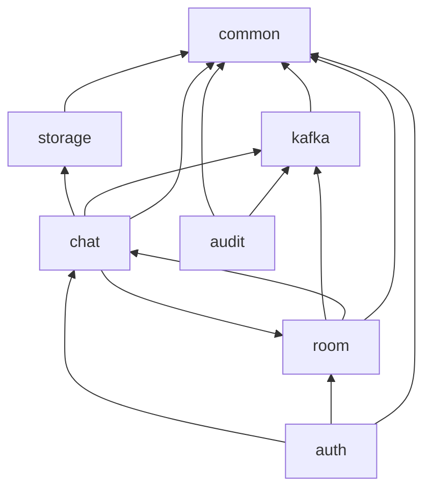

## Docker Service Dependencies

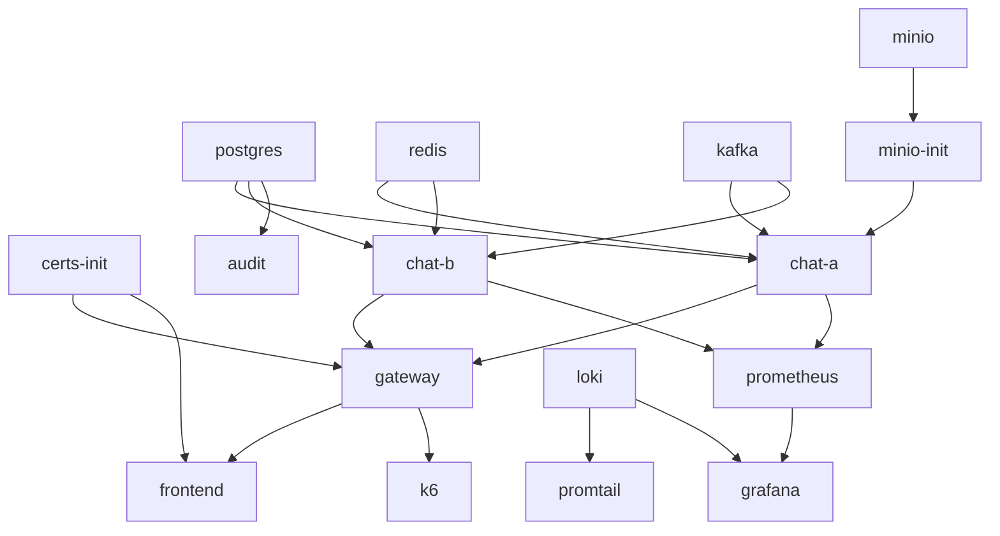

## Frontend Module Dependencies

```mermaid
flowchart BT
    pages[pages] --> components
    pages --> chat[chat/ChatContext]
    pages --> auth[auth/AuthContext]
    chat --> api
    chat --> ws
    auth --> api
    api --> client
    components --> chat
    main[main.jsx] --> App
    App --> pages
```

## Maven Dependency Highlights

Spring Web → Security → JPA → WebSocket → Redis → Kafka → Flyway → jjwt → AWS S3 SDK → Micrometer Prometheus → PostgreSQL driver.

---

# 35. Startup and Shutdown Lifecycle

## `docker compose up --build` Trace

| Order | Container | Action |
|-------|-----------|--------|
| 1 | **certs-init** | Runs `generate.sh`; creates CA + server.crt/key in `./certs/` if missing; exits 0 |
| 2 | **postgres** | Starts; healthcheck `pg_isready` |
| 3 | **redis** | Starts; healthcheck `PING` |
| 4 | **kafka** | KRaft broker starts; healthcheck broker API |
| 5 | **minio** | Starts object store |
| 6 | **minio-init** | `mc mb local/gamechat`; exits |
| 7 | **chat-a, chat-b** | JVM starts → Flyway V1–V7 → Redis listener subscribe → WS endpoint → Actuator |
| 8 | **audit-consumer** | Same JAR, profile `audit`, Kafka consumer group `gamechat-audit` |
| 9 | **gateway** | nginx loads TLS certs, upstream chat-a/b |
| 10 | **frontend** | nginx serves Vite build, proxy to gateway |
| 11 | **loki, promtail, prometheus, grafana** | Observability stack |

## Per Chat Node Spring Boot Startup

1. Load `application.yml` + env overrides
2. Flyway migrate Postgres
3. Hibernate validate schema
4. Create Redis connection + `ChatEventListener` subscription on `chat.events`
5. Register `/ws/chat` WebSocket handler
6. Start `@Scheduled` sweepers (heartbeat, presence)
7. Kafka producer if enabled; consumer if log-listener/profile audit
8. Listen on `:8080`

## Graceful Shutdown

| Component | Behavior |
|-----------|----------|
| Spring Boot | SIGTERM → stop accepting new HTTP/WS |
| WebSocket | Connections closed; may drop in-flight |
| Redis listener | Unsubscribes |
| Kafka consumer | Commits offsets (auto-commit) |
| nginx | Drains connections on SIGTERM (default) |
| Postgres | Transactions complete or rollback |

**Gap:** No explicit WS graceful drain period configured in compose.

---

# 36. End-to-End Data Flow

## User Sends Chat Message (Complete Path)

```
1. USER types in Composer.jsx
2. VALIDATION: trim, max 2000 chars (client-side UX; server enforces)
3. ChatContext.sendMessage() → chatSocket.sendMessage()
4. WS FRAME: { type: "SEND_MESSAGE", roomId, content, requestId }
5. frontend nginx → gateway nginx → chat-a (least_conn)
6. ChatWebSocketHandler.handleSend()
7. AUTH CHECK: session authenticated via prior AUTH frame
8. MEMBERSHIP: RoomService verifies member, not muted
9. RATE LIMIT: Redis INCR ratelimit:send:{userId}
10. BUSINESS LOGIC: ChatService.sendMessage()
11. DATABASE TX:
    a. SELECT room FOR UPDATE
    b. Check requestId idempotency
    c. last_sequence++
    d. INSERT messages
    e. COMMIT
12. METRICS: chat.messages.sent increment
13. KAFKA (if enabled): chat.message.persisted produce
14. RESPONSE TO SENDER: ACK frame with messageId, sequenceNumber
15. REDIS: publishAfterCommit ChatEvent MESSAGE
16. ALL NODES ChatEventListener receives
17. LocalFrameSender.sendToRoom() → WS MESSAGE to subscribed sessions
18. RECEIVERS: frontend ChatContext handles MESSAGE, updates UI
19. AUTO ACK: client sends MESSAGE_ACK → DELIVERY broadcast (ephemeral)
20. UI renders message in MessageList with sequence, reactions, ticks
```

## User Login (Complete Path)

```
Register/Login form → client.js fetch → gateway → AuthService
→ BCrypt verify → autoJoinGlobal → JWT + refresh INSERT
→ Set-Cookie + JSON → sessionStorage → AuthContext timer
→ Navigate to ChatPage → ChatProvider connects WS → AUTH frame
→ CONNECTED → refreshRooms GET /api/rooms
```

---

# Appendix A: WebSocket Frame Reference

### Client → Server

| type | Required fields |
|------|-----------------|
| AUTH | token |
| JOIN_ROOM | roomId; optional afterSequence, requestId |
| LEAVE_ROOM | roomId |
| SEND_MESSAGE | roomId, content; optional requestId |
| PING | optional requestId |
| TYPING | roomId, isTyping |
| SET_PRESENCE | status: ONLINE\|AWAY\|IN_GAME |
| DELETE_MESSAGE | roomId, messageId |
| EDIT_MESSAGE | roomId, messageId, content |
| MARK_READ | roomId, sequenceNumber |
| ADD_REACTION | roomId, messageId, emoji |
| REMOVE_REACTION | roomId, messageId, emoji |
| MESSAGE_ACK | roomId, messageId |

### Server → Client

CONNECTED, JOINED, LEFT, HISTORY_SYNC, PRESENCE_SNAPSHOT, PRESENCE, ACK, PONG, MESSAGE, TYPING, MESSAGE_DELETED, MESSAGE_EDITED, READ, DELIVERY, REACTION, ERROR

---

# Appendix B: Version History (from README)

| Version | Highlights |
|---------|------------|
| **V6** | Two chat nodes, Redis fan-out, Kafka log, JWT, room types, moderation |
| **V7** | Ban/promote, unread, idempotent send, FTS, reactions, attachments, UI moderation |
| **V8** | Loki/Promtail, audit-consumer, Prometheus auth, k6 load test |

---

# Appendix C: Key File Index

| Concern | Path |
|---------|------|
| Entry point | `backend/src/main/java/com/example/gamechat/GameChatApplication.java` |
| Security | `backend/.../auth/security/SecurityConfig.java` |
| WS handler | `backend/.../chat/websocket/ChatWebSocketHandler.java` |
| Redis bus | `backend/.../chat/bus/ChatEventPublisher.java` |
| Room domain | `backend/.../room/service/RoomService.java` |
| Compose | `docker-compose.yml` |
| Gateway | `gateway/nginx.conf` |
| Frontend proxy | `frontend/nginx.conf` |
| API docs | `API.md` |
| Migrations | `backend/src/main/resources/db/migration/V*.sql` |

---

*End of Project Architecture Handbook*
